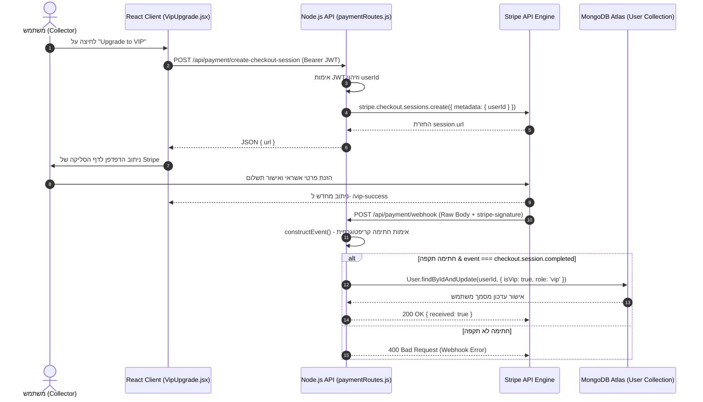
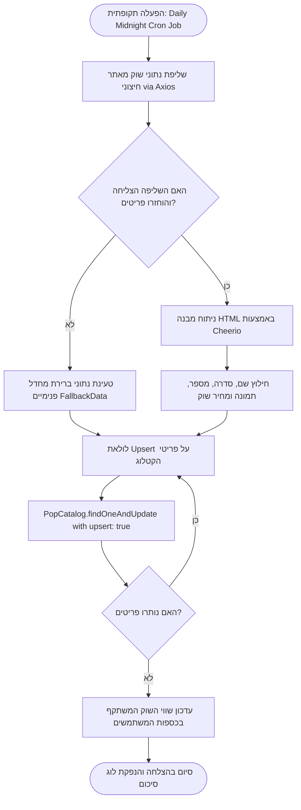
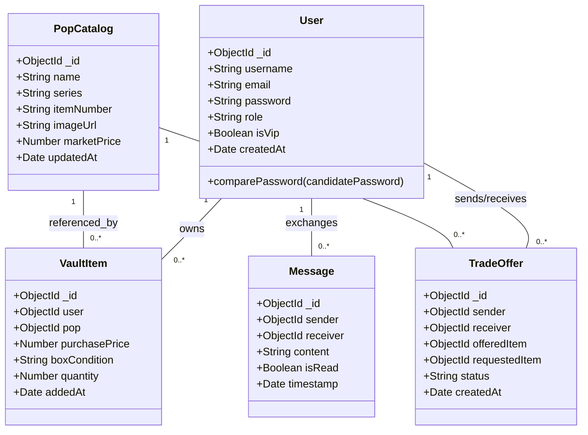
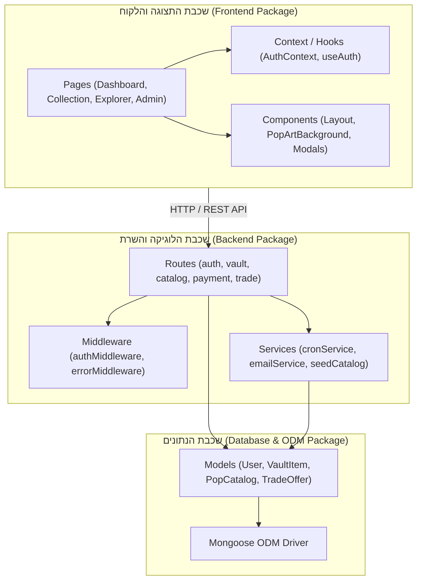
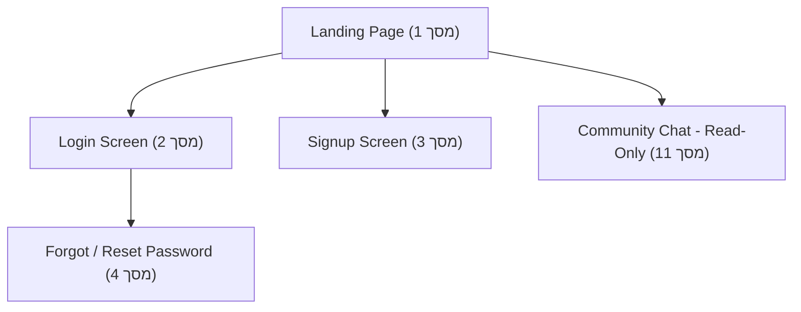
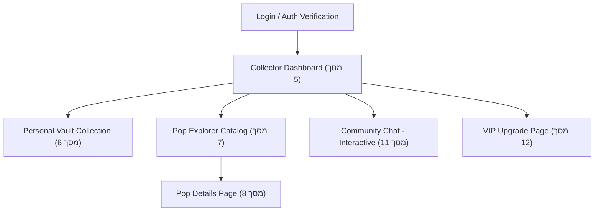
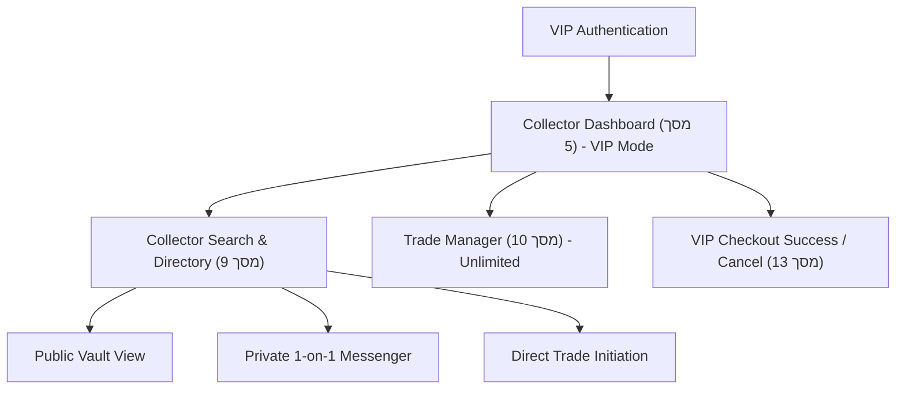
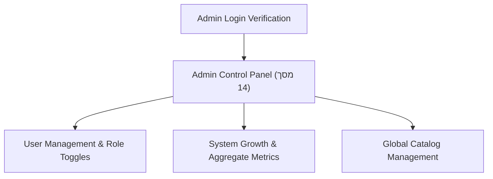

# ספר פרויקט גמר הנדסי — MyPopVault
**פלטפורמה חכמה לניהול, ניטור פיננסי ומסחר באוספי Funko Pop**

---

## 1. פרטי הסטודנטים

* **תאריך הגשה:** 01/08/2026
* **לכבוד:** יחידת הפרויקטים — מה"ט (המכון הממשלתי להכשרה בטכנולוגיה ומדע)
* **שם המכללה:** המכללה למינהל — שלוחת פתח תקווה
* **סמל מכללה:** 72214
* **מסלול ההכשרה:** הנדסאים
* **מגמת לימוד:** הנדסת תוכנה
* **מקום ביצוע הפרויקט:** המכללה למינהל פתח תקווה

| שם הסטודנט | ת.ז. 9 ספרות | כתובת | טלפון נייד | תאריך סיום הלימודים |
| :--- | :--- | :--- | :--- | :--- |
| **אליעד חגאג** | 3eliadhagag3 | פתח תקווה | 054-0000000 | 01/08/2026 |

---

## 2. פרטי המנחה האישי

| שם המנחה | כתובת | טלפון נייד | תואר | מקום עבודה / תפקיד |
| :--- | :--- | :--- | :--- | :--- |
| **סרגיי אליינוב** | `sergeyal@college.org.il` | 054-4790661 | M.A. | מנהל המכללה למינהל — שלוחת פתח תקווה |

| שם החותם | תפקיד החותם | חתימה |
| :--- | :--- | :--- |
| סרגיי אליינוב | ראש המגמה | [חתימה מאושרת] |
| סרגיי אליינוב | המנחה האישי | [חתימה מאושרת] |
| אליעד חגאג | סטודנט 1 | [חתימת הסטודנט] |
| הגורם המקצועי | מטעם מה"ט | |

---

## 3. שם פרויקט הגמר
**MyPopVault** — פלטפורמת Web מתקדמת לניהול מלאי, ניטור פיננסי, ויזואליזציה ומסחר באוספי Funko Pop.

---

## תוכן העניינים

1. **פרטי הסטודנטים**
2. **פרטי המנחה האישי**
3. **שם פרויקט הגמר**
4. **תיאור ורקע כללי**
5. **מטרות המערכת**
6. **סקירת מצב קיים בשוק, אילו בעיות קיימות**
7. **מה הפרויקט אמור לחדש או לשפר**
8. **דרישות מערכת ופונקציונאליות**
   - 8.1 דרישות מערכת
   - 8.2 דרישות פונקציונאליות
   - 8.3 חדשנות טכנולוגית ופתרונות מבוססי AI
9. **בעיות צפויות במהלך הפיתוח ופתרונות**
10. **פתרון טכנולוגי נבחר**
    - 10.1 טכנולוגיות בשימוש (איזה ומדוע)
    - 10.2 שפות הפיתוח (איזה שפות ומדוע)
    - 10.3 תיאור הארכיטקטורה הנבחרת
    - 10.4 חלוקה לתכניות ומודולים
    - 10.5 סביבת השרת
    - 10.6 ממשק המשתמש/לקוח (GUI)
    - 10.7 ממשקים למערכות אחרות (APIs)
    - 10.8 שימוש בחבילות תוכנה
11. **שימוש במבני נתונים וארגון קבצים**
    - 11.1 פירוט מבנה הנתונים ושיטות האחסון
    - 11.2 תרשימי מערכת מרכזיים (UML Diagram Suite)
12. **תיאור המרכיב האלגוריתמי – חישובי**
13. **תיאור מידע וניתוחים סטטיסטיים (אנליטיקות)**
14. **תיאור/התייחסות לנושאי אבטחת מידע**
15. **משאבים נדרשים לפרויקט**
    - 15.1 היקף שעות וחלוקת עבודה
    - 15.2 ציוד נדרש
    - 15.3 תוכנות נדרשות
    - 15.4 ידע חדש שנדרש ללמוד
    - 15.5 ספרות ומקורות מידע
16. **תכנית עבודה ושלבים למימוש הפרויקט**
17. **בקרת גרסאות (Version Control)**
18. **נספח ממשק משתמש (UI Appendix)**
19. **נספח קוד (Code Appendix)**

---

## 4. תיאור ורקע כללי

בשנים האחרונות הפכה אספנות דמויות ה-Funko Pop מתחביב נישתי לתופעה תרבותית וכלכלית גלובלית החולשת על שוק של מיליארדי דולרים. דמויות אלו, המיוצרות בסדרות מוגבלות (Limited Editions), גרסאות בלעדיות לנספחים וכנסים (Exclusives), ומהדורות זוהרות בחושך (Glow in the Dark / Chase), משנות את ערכן הפיננסי באופן תדיר. עבור אספנים רציניים, בובת Pop אינה עוד פריט תצוגה פלסטי, אלא נכס השקעתי אלטרנטיבי לכל דבר, אשר ערכו עשוי לזנק במאות ואף אלפי אחוזים תוך פרקי זמן קצרים, או לחלופין לרדת עקב ייצור מחדש (Re-run).

המערכת **MyPopVault** פותחה כפלטפורמת Web מתקדמת מקצה לקצה (End-to-End) המיועדת לניהול, ניטור פיננסי, ויזואליזציה ומסחר באוספי Funko Pop. הפלטפורמה מספקת לאספן מעטפת טכנולוגית מלאה: החל מקטלוג דינמי של הפריטים באוסף האישי (Personal Vault), דרך מעקב אוטומטי בזמן אמת אחר שווי השוק (Market Value) של כל פריט באמצעות התממשקות למקורות מידע חיצוניים, וכלה בחישוב מדויק של תשואת התיק (ROI — Return on Investment), הרווח/ההפסד הגולמי, וזיהוי פריטי דגל נדירים ("Grails").

מעבר לפן הפיננסי, MyPopVault מקימה זירה קהילתית פעילה המאפשרת לאספנים לשתף את האוסף הציבורי שלהם, לאתר אספנים אחרים, לבצע חיפושים מתקדמים, ליצור קשר ישיר דרך צ'אט הודעות בזמן אמת, ולהציע הצעות סחר (Trade Offers) מורכבות במנגנון דו-צדדי מאובטח.

---

## 5. מטרות המערכת

מטרות המערכת חולקו לשלושה צירים מרכזיים: תפעולי, טכנולוגי ועסקי:

### 5.1 מטרות תפעוליות (Operational Goals):
* **ניהול מלאי אישי חכם:** אספקת ממשק ניהול דיגיטלי אינטואיטיבי המאפשר ביצוע פעולות CRUD מלאות על האוסף האישי (הוספה, צפייה, עדכון מחיר קנייה/מצב קופסה, ומחיקה).
* **שקיפות ונגישות למידע:** מתן אפשרות לאספנים לצפות בנתוני הקטלוג המלאים, כולל דרגת נדירות, מספרי סדרה ותמונות באיכות גבוהה.

### 5.2 מטרות טכנולוגיות (Technological Goals):
* **אוטומציה של עדכוני מחירים:** ביצוע סנכרון אוטומטי תקופתי מול שירותי Web Scraping ו-API חיצוניים לקבלת נתוני שוק עדכניים ללא התערבות ידנית של המשתמש.
* **אנליטיקה וויזואליזציה מתקדמת:** פיתוח מנוע חישובי המפיק מדדים פיננסיים (תשואה באחוזים, רווח נומינלי, הפלגות מחיר) והצגתם באמצעות גרפים דינמיים ולוחות בקרה (Dashboards) מותאמים.
* **מנגנון תרחישי סחר (Trading Engine):** מימוש מערכת ניהול הצעות מחיר והחלפות בין משתמשים עם מעקב סטטוס בזמן אמת (Pending, Accepted, Rejected, Cancelled).

### 5.3 מטרות עסקיות ומודל הכנסות (Business & Monetization Model):
* **מודל Freemium דינמי:** המערכת מציעה גישה בסיסית חינמית המאפשרת ניהול אוסף בסיסי. 
* **מנוע מנויים VIP מבוסס Stripe:** שדרוג מנויים בתשלום (VIP Premium Upgrade) המעניק גישה לתכונות פרימיום: נפח אחסון בלתי מוגבל בכספת, תגי VIP יוקרתיים בפרופיל, גישה למנוע חיפוש אספנים מתקדם, ערוצי צ'אט פרטיים, והתראות חכמות על שינויי מחיר של פריטי Grail.

---

## 6. סקירת מצב קיים בשוק, אילו בעיות קיימות

סקירת השוק מעלה כי כיום רוב האספנים נאלצים להשתמש בפתרונות חלקיים, מבוזרים ולא מותאמים:

1. **ניהול ידני באמצעות גיליונות אלקטרוניים (Excel / Google Sheets):**
   * *הבעיה:* תהליך איטי, מסורבל וחשוף לטעויות אנוש. האספן נדרש לעדכן ידנית את מחירי השוק של כל פריט ופריט על ידי חיפוש פרטני באתרי מכירות (כדוגמת eBay או StockX).
   * *התוצאה:* הנתונים אינם מעודכנים בזמן אמת, והאספן מאבד מעקב אחר שווי התיק הריאלי.

2. **היעדר תמונה פיננסית כוללת ומחשבון תשואה (ROI):**
   * *הבעיה:* אפליקציות פשוטות לניהול רשימות (Notes / Checklist apps) אינן כוללות מנגנון חישובי המצליב בין מחיר הקנייה המקורי (Purchase Price) לבין מחיר השוק העדכני (Market Price).
   * *התוצאה:* חוסר יכולת להבין את הרווחיות/ההפסד המצטבר של האוסף כתיק השקעות.

3. **חוויית משתמש מיושנת והיעדר קהילתיות ומסחר:**
   * *הבעיה:* פלטפורמות קיימות בשוק סובלות ממשק משתמש (UI) מיושן, היעדר התאמה למובייל (Non-responsive), וחוסר ביכולת תקשורת ישירה או ביצוע החלפות פריטים מאובטחות בין אספנים בתוך המערכת.

---

## 7. מה הפרויקט אמור לחדש או לשפר

המערכת **MyPopVault** מביאה עמה מספר חידושים ושיפורים הנדסיים בולטים:

1. **אוטומציה מלאה של נתוני שוק:** שליפת מחירי שוק בזמן אמת ועדכונם ברקע באמצעות הליכי Cron ניהוליים ומנגנוני Caching חכמים, המונעים את הצורך בהזנה ידנית.
2. **דשבורד פיננסי ואנליטי מתקדם:** ויזואליזציה מרהיבה המציגה התפלגות קטגוריות (פילוג לפי Marvel, Star Wars, Anime וכו'), התפלגות רווח/הפסד, והבלטת הפריט היקר ביותר באוסף.
3. **מנוע סחר (Trade Center) מובנה:** מנגנון המאפשר לאספנים להציע החלפות של פריטים מהכספת האישית שלהם מול פריטים של אספנים אחרים, כולל צ'אט הודעות ישיר (Direct Messaging) לתאום איסוף או משלוח.
4. **אבטחה וארכיטקטורה מודרנית:** הפרדה מוחלטת בין שכבת הלקוח (Single Page Application ב-React) לבין שכבת השרת (RESTful API ב-Node.js/Express) עם אבטחת טוקנים (JWT), הצפנת סיסמאות מתקדמת (Bcrypt), ואינטגרציה מאובטחת לסליקת אשראי בתקן PCI דרך Stripe Webhooks.

---

## 8. דרישות מערכת ופונקציונאליות

### 8.1 דרישות מערכת (Non-Functional Requirements)

* **סביבת הטמעה ונגישות:** המערכת מפותחת כיישום Web רספונסיבי מלא (Responsive Web Application), התומך באופן מלא בדפדפנים מודרניים (Chrome, Edge, Safari, Firefox) הן במסכי מחשב שולחני והן במכשירים ניידים (Mobile & Tablet).
* **זמינות גבוהה (High Availability & Production Architecture):** תשתית האפליקציה מחולקת בצורה מנותקת (Decoupled System):
  - **צד לקוח (Frontend SPA):** מאוחסן ב-**GitHub Pages** בדומיין המרכזי [https://mypopvault.online](https://mypopvault.online) (הגדרה ב-Hostinger עם רשומת CNAME וצינור פריסה אוטומטי ב-GitHub Actions via `deploy.yml`).
  - **צד שרת (Backend REST API & WebSockets):** מוטמע בשרת ענן ייעודי **AWS EC2 (Ubuntu Linux)** בעל כתובת Elastic IP נייחת (`54.145.50.157`) ותת-דומיין מאובטח [https://api.mypopvault.online](https://api.mypopvault.online) (רשומת A).
  - **תזמור מכלים (Docker Compose):** השרת מנהל 3 שירותים מבודדים במכולות Docker: שרת Node.js Express (פורט 5000 פנימי), שרת Nginx Reverse Proxy (הורדת עומסים, ניתוב SSL, והפניה אוטומטית מפורט 80 ל-443), ותהליך Certbot (חידוש אוטומטי לתעודות SSL Let's Encrypt).
  - **בסיס נתונים:** מסד נתונים בענן **MongoDB Atlas Cloud** המבטיח זמינות של 99.9% וגיבויים אוטומטיים.
* **ביצועים וזמני תגובה:** זמן טעינת דף ראשוני (Initial Load) מתחת ל-1.5 שניות. שריפת קריאות API בזמן ממוצע של פחות מ-150ms באמצעות אינדוקס שאילתות ושימוש בדפדף (Pagination).
* **שרידות והתמודדות עם עומסים:** ניהול שגיאות מרכזי (Global Error Handling Middleware), מנגנון ניסיון חוזר (Retry mechanism) בחיבור לבסיס הנתונים, ותחימת קצב בקשות (Rate Limiting) למניעת התקפות מניעת שירות (DoS).

### 8.2 דרישות פונקציונאליות (Functional Requirements by User Roles)

#### 1. משתמש תפעולי / אספן (Standard Collector):
* **אימות וניהול פרופיל:** הרשמה, התחברות, איפוס סיסמה מאובטח, ועדכון פרטים אישיים ותמונת פרופיל.
* **ניהול כספת אישית (Personal Vault CRUD):** הוספת פריטים מהקטלוג לכספת האישית, עדכון מחיר קנייה ידני, עדכון מצב קופסה (Mint, Near Mint, Damaged), עדכון כמות, ומחיקת פריטים.
* **צפייה באנליטיקות אישיות:** צפייה בדשבורד המציג את שווי האוסף הכולל, סך ההשקעה, רווח/הפסד נומינלי ואחוזי, והתפלגות פריטים לפי סדרות.
* **סייר קטלוג:** חיפוש דינמי וסינון פריטי Pop לפי קטגוריות, שמות ונדירות, וצפייה בדף פרטי פריט מורחב.
* **מערכת החלפות וצ'אט:** שליחת הצעות סחר לאספנים אחרים, ניהול הצעות נכנסות/יוצאות, וניהול שיחות בצ'אט פרטי.

#### 2. משתמש VIP (VIP Premium Collector):
* **הרשאות מורחבות:** כל פונקציונליות המשתמש הסטנדרטי, בנוסף לאחסון פריטים ללא הגבלה בכספת.
* **חיפוש אספנים מתקדם:** גישה למנוע חיפוש אספנים המאפשר צפייה באוספים ציבוריים של משתמשים אחרים במערכת (Public Vaults).
* **תגי יוקרה והתראות:** הצגת תג VIP יוקרתי (VIP Badge) בכל אזורי הקהילה והצ'אט, וקבלת התראות מיוחדות.

#### 3. מנהל מערכת (Admin / Business Owner):
* **דשבורד מנהלים עסקי:** צפייה בסטטיסטיקות מערכת כוללות: כמות משתמשים רשומים, פילוח משתמשי חינם מול VIP, הכנסות משודרגות, וכמות פריטים כוללת במערכת.
* **ניהול משתמשים (User Management):** צפייה ברשימת כל המשתמשים, שינוי תפקידים (User -> VIP / Admin), חסימת משתמשים, ואיפוס סיסמאות מנהלי.
* **ניהול קטלוג גלובלי:** הוספה, עריכה ומחיקה של פריטים בקטלוג המרכזי.

### 8.3 חדשנות טכנולוגית ופתרונות מבוססי AI (AI & Innovative Solutions)

המערכת משלבת חדשנות טכנולוגית המבוססת על מנועי בינה מלאכותית (AI) ואלגוריתמי ניתוח מתקדמים במטרה להעשיר את חוויית האספן:

* **מנוע המלצות רכישה חכם (AI Smart Recommendation Engine):** מנגנון AI המנתח את הרכב התיק האישי של האספן (התפלגות סדרות כדוגמת Marvel, Star Wars, Anime), מצליב אותו מול מגמות עליית מחירים בשוק (Market Price Trends) ומציג לאספן המלצות מותאמות אישית לגבי פריטי Pop שכדאי לו לרכוש במטרה למקסם את תשואת התיק (ROI Potential) ולהשלים סדרות מבוקשות.
* **זיהוי והתראות פריטי דגל (AI Grail Alert Classifier):** מנגנון למידה ואגרגציה המזהה פריטי "Grail" נדירים שערכם מזנק באופן חריג, ומפיק התראות חכמות למשתמשי VIP על הזדמנויות רכישה וסחר לפני שינויי מחיר משמעותיים בשוק.

---

## 9. בעיות צפויות במהלך הפיתוח ופתרונות

### 9.1 תיאור הבעיות כפועל יוצא מדרישות המערכת

1. **מגבלות API וחסימות Scraper חיצוני (Rate Limiting & Anti-Scraping):**
   * *הבעיה:* שליפת מחירי שוק מאתרים חיצוניים בזמן אמת עבור כל בקשת משתמש עלולה להוביל לחסימת כתובת ה-IP של השרת עקב הצפה (Rate Limit Exceeded), ולזמני טעינה ארוכים מאוד בצד הלקוח.
2. **עומס נתונים ואיטיות בשליפת כספות גדולות (Database Performance Overhead):**
   * *הבעיה:* ככל שאספנים מוסיפים מאות פריטים לכספת, שאילתות הצלבה (Populations / Joins) בין אוסף ה-`VaultItem` לבין אוסף ה-`PopCatalog` עלולות לגרום לאיטיות ניכרת בתגובת השרת.
3. **תיאום מצב (State Synchronization) בתהליכי תשלום מורכבים ב-Stripe:**
   * *הבעיה:* סגירת דפדפן על ידי המשתמש במהלך מעבר לדף התשלום ב-Stripe עלולה לגרום לחוסר עקביות (Inconsistency), שבו החשבון חויב אך מסד הנתונים לא עודכן בסטטוס VIP.

### 9.2 פתרונות אפשריים וחלוציות ארכיטקטונית

1. **פתרון בעיית ה-API:** מימוש מנגנון משיכה תקופתי (Scheduled Cron Job) הרץ אחת ל-24 שעות בשעות השפל (חצות). השרת מעדכן את מסד הנתונים הפנימי (`PopCatalog`), והלקוח מקבל נתונים מהירים ישירות ממסד הנתונים המקומי בגישת Caching.
2. **פתרון עומס הנתונים:** החלת אינדקסים מורכבים (Compound Indexes) ברמת בסיס הנתונים MongoDB על השדות `{ user: 1, pop: 1 }`, בשילוב מנגנון דפדוף (Pagination) המגביל טעינה ל-12-24 פריטים בכל בקשה.
3. **פתרון עקביות התשלום:** שימוש ב-Stripe Webhooks עם אימות חתימה קריפטוגרפית (`stripe-signature`). השרת מקבל הודעת Asynchronous Event ישירות משרתי Stripe (`checkout.session.completed`) ומעדכן את המשתמש במסד הנתונים באופן אטומי, ללא תלות בדפדפן הלקוח.

---

## 10. פתרון טכנולוגי נבחר

### 10.1 טכנולוגיות בשימוש (איזה ומדוע)

בפרויקט זה נבחרו טכנולוגיות מודרניות, יציבות ורחבות תמיכה בתעשייה:

1. **צד שרת — Node.js & Express.js:**
   * *איזה:* סביבת ריצה Node.js עם פרימוורק Express.js.
   * *מדוע:* סביבת ה-Event-Driven וה-Non-blocking I/O של Node.js מאפשרת טיפול יעיל ביותר בריבוי בקשות HTTP בו-זמנית ובמשימות רקע אסינכרוניות (Cron Jobs). השימוש ב-Node.js מבטיח אחידות קוד מלאה (Full-Stack JavaScript) הן בשרת והן בלקוח.

2. **צד לקוח — React.js (Vite Tooling):**
   * *איזה:* ספריית React.js מבית Meta, בשילוב כלי הבנייה Vite.
   * *מדוע:* ארכיטקטורת רכיבים (Component-Based) המאפשרת שימוש חוזר ברכיבי UI. מנוע ה-Virtual DOM של React מבטיח רינדור מהיר של רשימות קטלוג גדולות, בעוד Context API ו-Hooks מאפשרים ניהול State גלובלי.

3. **בסיס נתונים — MongoDB Atlas (NoSQL Document Store):**
   * *איזה:* מסד נתונים NoSQL מבוסס מסמכי JSON/BSON בענן, מנוהל באמצעות Mongoose ODM.
   * *מדוע:* גמישות מבנית המתאימה לנתוני Pop משתנים, מנגנון אגרגציות מתקדם לחישובים פיננסיים, ואירוח בענן עם Replica Sets לזמינות מרבית.

4. **אינטגרציית תשלומים — Stripe API & Webhooks:**
   * *איזה:* פלטפורמת התשלומים Stripe.
   * *מדוע:* סליקה מאובטחת בתקן PCI-DSS, ומנגנון Webhooks המאומת קריפטוגרפית להבטחת עדכון אטומי של מנוי VIP.

5. **עיבוד נתונים אוטומטי — Cheerio & Node-Cron:**
   * *איזה:* ספריית ניתוח HTML Cheerio וספריית תזמון משימות Node-Cron.
   * *מדוע:* ניתוח DOM מהיר בצד השרת במינימום צריכת זיכרון, ותזמון משימות משיכת מחירים מדי חצות ברמת הזיכרון.

6. **אבטחה — JWT & Bcryptjs:**
   * *איזה:* JSON Web Tokens (JWT) להרשאות, ו-Bcryptjs להצפנת סיסמאות.
   * *מדוע:* ניהול הרשאות Stateless ב-JWT והצפנה חד-כיוונית מוצפנת Salt ב-Bcrypt להגנה על סיסמאות.

### 10.2 שפות הפיתוח (איזה שפות ומדוע)

1. **JavaScript (ES6+):** שפת הפיתוח המרכזית (Full-Stack JS). צד שרת ב-Node.js (CommonJS) וצד לקוח ב-React (ES Modules).
2. **JSX (JavaScript XML):** הרחבת סינטקס עבור רכיבי התצוגה הדינמיים ב-React (`.jsx`).
3. **HTML5:** שפת סימון לבניית השלד הסמנטי (`index.html`), Viewports רספונסיביים ונגישות.
4. **CSS3, Tailwind CSS & PostCSS:** שפות עיצוב ועיבוד מקדים למימוש סגנון ה-Pop-Art Neo-Brutalism, גבולות עבים והצללות.
5. **JSON & BSON:** פורמט חילוף נתונים ב-REST API, קובצי תצורה (`package.json`), ואחסון מסמכים ב-MongoDB.
6. **MongoDB Query Language (MQL):** שפת שאילתות ואגרגציות לחישובים פיננסיים ב-Mongoose.
7. **YAML:** שפת תצורה לתזמור מכלים בקובץ `docker-compose.yml`.
8. **Dockerfile Syntax & Shell Scripting:** שפת בניית אימוג'ים ותסריטי הפעלה (`npm run seed:catalog`).
9. **TypeScript Declarations:** הגדרות טיפוסים (`@types/node`, `@types/react`) לבדיקת תקינות ב-VS Code.

### 10.3 תיאור הארכיטקטורה הנבחרת
ארכיטקטורת Client-Server בתצורת **Single Page Application (SPA)** מנותקת (Decoupled Architecture). דפדפן הלקוח טוען מ-GitHub Pages את אפליקציית ה-React ומבצע תקשורת אסינכרונית (REST API & WebSockets) מול שרת AWS EC2 תחת תת-הדומיין `api.mypopvault.online`. כל בקשות ה-API וה-Fetch בצד הלקוח עוברות דרך הליפר מרכזי `getApiUrl` (`src/lib/api.js`), המצמיד דינמית את `VITE_API_BASE_URL` בסביבת הייצור (מוזרק דרך GitHub Actions via `deploy.yml`) ופותר בעיות ניתוב, CORS ושגיאות 405.

### 10.4 חלוקה לתכניות ומודולים
* **צד לקוח (Client Modules):** `AuthContext`, דפים (`Dashboard`, `Collection`, `Explorer`, `TradeManager`, `VipUpgrade`, `AdminPanel`), ורכיבי תצוגה.
* **צד שרת (Server Modules):** `authRoutes`, `vaultRoutes`, `catalogRoutes`, `paymentRoutes`, `tradeRoutes`, `messageRoutes`, `cronService` ו-`seedCatalog`.

### 10.5 סביבת השרת והטמעה
* **פיתוח (Development):** הרצה מקומית בסביבת `Node.js Environment` (Localhost:5000 / Vite Dev Server).
* **ייצור (Production Environment & Infrastructure):**
  - **Frontend SPA:** מוגש מ-**GitHub Pages** (`https://mypopvault.online`) עם תהליך CI/CD אוטומטי ב-GitHub Actions (`deploy.yml`).
  - **Backend API & WebSockets:** מופעל על גבי שרת **AWS EC2 Ubuntu Linux** עם Elastic IP (`54.145.50.157`) בדומיין `api.mypopvault.online`.
  - **תזמור Docker Compose:** שרת `backend` (פורט 5000 פנימי), שרת `nginx` כ-Reverse Proxy (ניהול תעודות SSL Let's Encrypt, הפניית HTTP 301 מפורט 80 ל-443, וניהול Websocket Headers עבור `/socket.io/`), ושירות `certbot`.
  - **Database:** מסד נתונים מנוהל בענן ב-**MongoDB Atlas Cloud**.

### 10.6 ממשק המשתמש / לקוח (GUI)
ממשק משתמש רספונסיבי מודרני בסגנון Pop-Art Neo-Brutalism (גבולות שחורים מודגשים, צבעוניות עזה, מיקרו-אנמציות ב-Framer Motion, ותמיכה מלאה במסכי Mobile). 
* **אופטימיזציית CSS ופתרון גלישה (Signup Form UI/CSS Overflow Fix):** פתרון בעיית גלישת תוכן וסרגל גלילה פנימי במסך ההרשמה (`Login.jsx` - Signup mode) באמצעות החלפת אילוצי `h-full` ו-`overflow-hidden` נוקשים ב-`min-h-full` ברכיב מעטפת הרקע (`PopArtBackground.jsx`), הגדרת גודל `h-auto` בכרטיס הטופס, צמצום המרווחים הפנימיים (`space-y-2`), והוספת פדינג חיצוני נדיב (`py-8`, `my-auto`, `pb-6`) המבטיחים מרכזיות אנכית מושלמת ללא חיתוכי תוכן או סרגלי גלילה פנימיים.

### 10.7 ממשקים למערכות אחרות (APIs)
* **Stripe API & Webhook Service:** סליקת אשראי ועיבוד אירועי תשלום מאובטחים.
* **External Funko Market Data Scraper:** שליפת מחירי שוק מאתרי אספנים גלובליים (`pops.today`).

### 10.8 שימוש בחבילות תוכנה

| שם החבילה | סביבה | ייעוד ותפקיד במערכת |
| :--- | :--- | :--- |
| `express` | Backend | תשתית השרת וניהול נתיבי REST API |
| `mongoose` | Backend | מידול נתונים (ODM) ותקשורת מול MongoDB |
| `jsonwebtoken` (JWT) | Backend | אימות משתמשים והנפקת אסימוני אבטחה מוצפנים |
| `bcryptjs` | Backend | ערבוב (Hashing) מוצפן של סיסמאות משתמשים |
| `stripe` | Backend | אינטגרציית סליקה ושדרוג מנויי VIP |
| `axios` | Backend/Frontend | ביצוע בקשות HTTP אסינכרוניות |
| `cheerio` | Backend | ניתוח מבנה HTML (DOM Scraping) לשליפת מחירים |
| `node-cron` | Backend | תזמון משימות אוטומטיות ברקע (Daily Price Sync) |
| `cors` & `helmet` | Backend | הגנת אבטחת HTTP Headers והרשאות Cross-Origin |
| `react` & `react-dom` | Frontend | ספריית ה-UI המרכזית לבניית תצוגת SPA |
| `framer-motion` | Frontend | מנוע אנמציות מתקדם לרכיבי ממשק המשתמש |
| `lucide-react` | Frontend | ערכת אייקונים וקטוריים מודרניים |
| `react-hot-toast` | Frontend | מערכת התראות ומשובים ויזואליים בזמן אמת |

---

## 11. שימוש במבני נתונים וארגון קבצים

### 11.1 פירוט מבנה הנתונים ושיטות האחסון
מסד הנתונים מאחסן מסמכי JSON/BSON גמישים ב-MongoDB Atlas Cloud:
1. **אוסף משתמשים (`User` Collection):** `username`, `email`, `password` (Hashed), `role`, `isVip`, `createdAt`.
2. **אוסף פריטי קטלוג (`PopCatalog` Collection):** `name`, `series`, `itemNumber`, `imageUrl`, `marketPrice`, `updatedAt`. אינדקס מורכב `{ name: 1, series: 1 }`.
3. **אוסף כספת אישית (`VaultItem` Collection):** `user` (Ref User), `pop` (Ref PopCatalog), `purchasePrice`, `boxCondition`, `quantity`, `addedAt`. אינדקס ייחודי מורכב `{ user: 1, pop: 1 }`.
4. **אוסף הצעות סחר (`TradeOffer` Collection):** `sender`, `receiver`, `offeredItem`, `requestedItem`, `status`, `createdAt`.

### 11.2 תרשימי מערכת מרכזיים (UML Diagram Suite)

#### תרשים 11.2.1: Use Case Diagram (כולל Include ו-Extend)

```mermaid
flowchart TD
    subgraph Act["שחקנים במערכת (Actors)"]
        Guest["אורח (Guest)"]
        Collector["אספן רגיל (Standard Collector)"]
        VIP["משתמש VIP (VIP Premium)"]
        Admin["מנהל מערכת (System Admin)"]
        StripeSys["מערכת Stripe External"]
    end

    subgraph SystemBoundary["מערכת MyPopVault"]
        UC1["הרשמה והתחברות"]
        UC2["צפייה בקטלוג ציבורי"]
        UC3["ניהול כספת אישית CRUD"]
        UC4["חישוב ROI ואנליטיקות כספת"]
        UC5["שדרוג מנוי ל-VIP"]
        UC6["חיפוש אספנים ואוספים ציבוריים"]
        UC7["יצירת הצעת סחר (Trade Offer)"]
        UC8["ניהול צ'אט הודעות פרטי"]
        UC9["דשבורד ניהול משתמשים וקטלוג"]
        
        UC_Auth["<<include>> אימות טוקן JWT"]
        UC_PayVerify["<<include>> אימות חתימת Webhook"]
        UC_GrailAlert["<<extend>> התראת פריט Grail"]
    end

    Guest --> UC1
    Guest --> UC2
    Collector --> UC3
    Collector --> UC4
    Collector --> UC5
    Collector --> UC7
    Collector --> UC8
    VIP --> UC6
    VIP --> UC3
    VIP --> UC7
    Admin --> UC9
    
    UC3 ..-> UC_Auth : include
    UC5 ..-> UC_PayVerify : include
    UC7 ..-> UC_Auth : include
    UC6 ..-> UC_GrailAlert : extend
    StripeSys --> UC5
```

#### תרשים 11.2.2: Sequence Diagram (שדרוג VIP ועיבוד Stripe Webhook)



#### תרשים 11.2.3: Activity Diagram (סנכרון מחירים אוטומטי)



#### תרשים 11.2.4: Class Diagram (מודל הנתונים ב-Mongoose)



#### תרשים 11.2.5: Package Diagram (ארכיטקטורה רב-שכבתית)



#### תרשים 11.2.6: Deployment Diagram (ארכיטקטורת פריסה)

```mermaid
flowchart LR
    subgraph ClientDevice["User Hardware Device"]
        Browser["Web Browser (Chrome / Safari / Edge)"]
    end

    subgraph GitHubPagesHost["GitHub Pages Hosting (Hostinger CNAME: mypopvault.online)"]
        FrontendSPA["Static React SPA Bundle (GitHub Actions deploy.yml)"]
    end

    subgraph AWSHost["AWS EC2 Standalone Instance (Ubuntu Linux - Elastic IP: 54.145.50.157)"]
        subgraph DockerComposeNet["Docker Compose Isolated Network"]
            NginxProxy["Nginx Reverse Proxy Container (Port 80/443, SSL Let's Encrypt)"]
            NodeContainer["Node.js Express API & Socket.IO WebSockets (Port 5000)"]
            CronScraper["Automated Scraper Cron Service"]
            CertbotService["Certbot SSL Renewal Container"]
        end
    end

    subgraph DBCloud["MongoDB Atlas Cloud Infrastructure"]
        MongoPrimary[("MongoDB Primary Replica Node")]
        MongoSecondary[("MongoDB Secondary Replica Node")]
    end

    subgraph ExternalAPIs["External SaaS Cloud Providers"]
        StripeSvc["Stripe Payment Gateway API"]
        BrevoSvc["Brevo API Email Service"]
        TargetScraper["External Funko Price Source (pops.today)"]
    end

    Browser <-->|HTTPS / TLS| FrontendSPA
    Browser <-->|HTTPS REST API & WSS / WebSockets (api.mypopvault.online)| NginxProxy
    NginxProxy <-->|Internal Proxy Pass| NodeContainer
    NodeContainer <-->|TLS / Mongoose Connections| MongoPrimary
    MongoPrimary <-->|Replication| MongoSecondary
    NodeContainer <-->|HTTPS Webhook / REST| StripeSvc
    NodeContainer <-->|HTTPS REST API| BrevoSvc
    CronScraper <-->|Web Scraping HTTP| TargetScraper
    CronScraper <-->|Mongoose Bulk Upsert| MongoPrimary
```

---

## 12. תיאור המרכיב האלגוריתמי – חישובי

### 12.1 ניתוח הבעיה והאלגוריתם הפיננסי (Real-Time Weighted Portfolio ROI Algorithm)

1. **הבעיה ההנדסית:** כל פריט בכספת האישית נרכש במועד שונה, במחיר קנייה מקורי שונה (`purchasePrice`), בכמות שונה (`quantity`), ובדרגת איכות קופסה שונה (`boxCondition`), בעוד מחירי השוק (`marketPrice`) משתנים באופן רציף.
2. **שלבי החישוב הפיננסי:**
   * *חישוב נומינלי ברמת הפריט:*
     $$\text{Item Investment}_i = \text{purchasePrice}_i \times \text{quantity}_i$$
     $$\text{Item Market Value}_i = \text{marketPrice}_i \times \text{quantity}_i$$
     $$\text{Item Profit/Loss}_i = \text{Item Market Value}_i - \text{Item Investment}_i$$
   * *שקלול התיק הכולל:*
     $$\text{Total Investment} = \sum_{i=1}^{n} \text{Item Investment}_i, \quad \text{Total Market Value} = \sum_{i=1}^{n} \text{Item Market Value}_i$$
   * *תשואה אחוזית משוקללת (Portfolio ROI %):*
     $$\text{Portfolio ROI (\%)} = \begin{cases} \left( \frac{\text{Total Market Value} - \text{Total Investment}}{\text{Total Investment}} \right) \times 100 & \text{if } \text{Total Investment} > 0 \\ 0\% & \text{if } \text{Total Investment} = 0 \end{cases}$$
3. **אלגוריתם סיווג פריטי דגל (Grail Classifier) ומיון חכם:** סיווג אוטומטי של פריטי Grail (מחיר שוק $\ge \$40$ או תשואה יחסית $\ge 150\%$) ומיון דינמי בזמן אמת.

### 12.2 מימוש אלגוריתמי ברמת בסיס הנתונים (MongoDB Aggregation Pipeline)

```javascript
// MongoDB Aggregation Pipeline for Real-Time Portfolio ROI & Analytics
const portfolioStats = await VaultItem.aggregate([
  { $match: { user: new mongoose.Types.ObjectId(userId) } },
  {
    $lookup: {
      from: 'popcatalogs',
      localField: 'pop',
      foreignField: '_id',
      as: 'popDetails'
    }
  },
  { $unwind: '$popDetails' },
  {
    $project: {
      itemInvestment: { $multiply: ['$purchasePrice', '$quantity'] },
      itemMarketValue: { $multiply: ['$popDetails.marketPrice', '$quantity'] },
      itemProfit: {
        $subtract: [
          { $multiply: ['$popDetails.marketPrice', '$quantity'] },
          { $multiply: ['$purchasePrice', '$quantity'] }
        ]
      },
      series: '$popDetails.series',
      isGrail: { $gte: ['$popDetails.marketPrice', 40] }
    }
  },
  {
    $group: {
      _id: null,
      totalInvestment: { $sum: '$itemInvestment' },
      totalMarketValue: { $sum: '$itemMarketValue' },
      totalProfit: { $sum: '$itemProfit' },
      totalItems: { $sum: 1 },
      grailCount: { $sum: { $cond: ['$isGrail', 1, 0] } }
    }
  },
  {
    $project: {
      totalInvestment: 1,
      totalMarketValue: 1,
      totalProfit: 1,
      totalItems: 1,
      grailCount: 1,
      roiPercentage: {
        $cond: [
          { $gt: ['$totalInvestment', 0] },
          { $multiply: [{ $divide: ['$totalProfit', '$totalInvestment'] }, 100] },
          0
        ]
      }
    }
  }
]);
```

---

## 13. תיאור מידע וניתוחים סטטיסטיים (אנליטיקות)

מנוע האנליטיקה במערכת מפיק דוחות חזותיים בזמן אמת המחולקים לשני דשבורדים:

### 13.1 דשבורד אנליטיקה לאספנים (Collector Dashboard Analytics)
* **מדדי מאקרו פיננסיים (Summary Widgets):** שווי שוק כולל ($), סך השקעה ($), רווח/הפסד נומינלי ($), ותשואה אחוזית משוקללת (ROI %).
* **גרף עוגה להתפלגות קטגוריות (Category Distribution Pie Chart):** פילוח האוסף לפי סדרות (Marvel, Star Wars, Anime, DC, Disney).
* **גרף השוואת השקעה מול שווי (Investment vs. Value Bar Chart):** השוואה חזותית ברמת הסדרה בין ההון שהושקע לשווי השוק הנוכחי.
* **מדד הפריט היקר ביותר (Top Performing Pop & Grail Status):** הבלטת הפריט בעל שווי השוק הגבוה ביותר בכספת ותג נדירות זוהר.
* **מדדים מורחבים למשתמשי VIP:** היסטוריית שינויי מחיר, התראות Grail ותחזיות שוק.

### 13.2 דשבורד אנליטיקה למנהלי מערכת (Admin & Business Analytics)
* **ניתוח מודל הכנסות ומנויים (Revenue & Subscription Metrics):** הכנסות לאורך זמן מ-Stripe, פילוח משתמשי חינם מול VIP, ויחס המרה (Conversion Rate).
* **פילוח פעילות פלטפורמה (Platform Activity Metrics):** כמות משתמשים פעילים, סך פריטים מנוהלים באתר, וכמות חיפושים/הוספות.
* **מדדי מערכת המסחר (Trading Engine Analytics):** נפח הצעות סחר, פילוח לפי סטטוסים (Accepted, Pending, Rejected), וזיהוי הפריטים המבוקשים ביותר.
* **ייצוא נתונים מנהלי (Data Export Engine):** ייצוא דוחות סטטיסטיים בפורמט CSV/Excel.

---

## 14. תיאור/התייחסות לנושאי אבטחת מידע

1. **הצפנת סיסמאות (Password Hashing):** שימוש בספריית `bcryptjs` עם סאלט (Salt Rounds = 10) לערבוב סיסמאות לפני שמירתן במסד הנתונים (הצפנה חד-כיוונית לאחור).
2. **אימות והרשאות (Authentication & Authorization):** אימות מבוסס **JSON Web Tokens (JWT)**. השרת מנפיק טוקן מוצפן וחתום המועבר ב-HTTP Header (`Bearer <token>`). Middlewares מיוחדים (`authMiddleware`, `requireAdmin`, `requireVIP`) בודקים הרשאות גישה בכל בקשת REST API.
3. **הגנות קלט בצד הלקוח (Client-Side Input Protections & Regex Filters):** המערכת כוללת מנגנון סינון Regex מותאם בזמן אמת המגביל הזנת תווים באנגלית בלבד בשדות האימות (`handleEnglishOnlyInput`), לצד מדד ויזואלי בזמן אמת לבדיקת חוזק סיסמה (Visual Password Strength Checklist).
4. **אימות חתימה קריפטוגרפית ב-Stripe Webhooks (Stripe Webhook Verification):** נתיב ה-Webhook משתמש ב-Raw Body Parser ובודק קריפטוגרפית את חתימת ה-HMAC SHA-256 (`stripe-signature`) מול המפתח הסודי `STRIPE_WEBHOOK_SECRET` למניעת בקשות מזויפות.
5. **אימות תקשורת דוא"ל (Brevo TLS Email Verification):** שימוש בפרוטוקול TLS מוצפן מול שרתי Brevo API לשליחת הודעות דוא"ל מאומתות עבור אימוצי חשבון חדשים וקישורי איפוס סיסמה חד-פעמיים בעלי תוקף מוגבל.
6. **הגנת שרת, מכולות ותשתיות (Server & Container Security):** שימוש ב-`Helmet` להגדרת HTTP Security Headers, הגדרת הרשאות `CORS` דינמיות ב-Socket.IO/Express, ניקוי קלטים (Sanitization) למניעת התקפות הזרקת NoSQL (NoSQL Injection), ובידוד רשת מוחלט במכולות Docker מול שרת ה-AWS EC2.
7. **אבטחת תשתיות וניהול מפתחות סודיים במשתני סביבה (.env Secrets Management & Security Groups):** בידוד מוחלט של מפתחות ה-Production (מחרוזת MongoDB Atlas, מפתחות Stripe API & Webhook Secret, ומפתחות Brevo SMTP/API) באמצעות הזרקתם הישירה לקובץ `.env` המאובטח בשרת AWS EC2 בלבד (אינו מועלה למאגר הקוד בחסות `.gitignore`), ומניעת חשיפת פורטים מיותרים ברמת AWS Security Groups (פתיחה ייעודית בלבד של פורט 443 ל-HTTPS ו-Nginx Reverse Proxy ופורט 80 להפניית 301).
8. **מנגנון ניתוב API מרכזי בארכיטקטורה מנותקת (Centralized API Routing Helper):** למניעת שגיאות ניתוב 405 ואבטחת תקשורת בין אירוח ה-SPA ב-GitHub Pages לשרת ה-AWS EC2, פותח הליפר מרכזי `getApiUrl` (`src/lib/api.js`). השרת מצמיד דינמית את `VITE_API_BASE_URL` (`https://api.mypopvault.online`) בסביבת הייצור (מוזרק ב-GitHub Actions via `deploy.yml`) ושומר על Vite proxy בסביבה מקומית.
9. **מנגנון הגנה דו-שכבתי לסינון אורחים בצ'אט (Two-Layer Defense Socket.IO Guest Filtering):** 
   - ברמת השרת (`server.js`): אירוע `joinChat` מאמת טוקן, משייך אורחים למצב Read-Only, ומסנן אותם מפורשות ממערך `onlineUsers` המשודר ב-Broadcast.
   - ברמת הלקוח (`CommunityChat.jsx`): מנגנון Defensive Filtering מונע שידור אירועי נוכחות של אורחים ומונע הצגתם בווידג'ט האספנים המחוברים ב-UI.
10. **סנכרון הרשאות אטומי ומניעת זליגת הרשאות (Atomic Role Sync & Privilege Escalation Prevention):** מנגנון ניהול המשתמשים (RBAC) מבצע סנכרון אטומי במסד הנתונים בין שדה התפקיד (role) לשדה הסטטוס (isVip). שדרוג או שלילת הרשאות מבוצעים באופן הרמטי בשרת ובתוך מטעני ה-JWT (Payload), ונתמכים באימות קשיח בצד הלקוח (AuthContext). מנגנון זה מתעלם משאריות זיכרון מטמון (Cache) מיושנות, ובכך מונע מצב של חוסר עקביות (State Mismatch) וגישה לא מורשית למסכי הפרימיום.

---

## 15. משאבים נדרשים לפרויקט

### 15.1 מספר השעות המוקדש לפרויקט, חלוקת עבודה
פרויקט זה מבוצע כפרויקט גמר יחיד על ידי הסטודנט אליעד חגאג. היקף השעות הכולל המוערך הינו **כ-400 שעות עבודה**, המחולקות בין אפיון, תכנון ארכיטקטוני, פיתוח Backend/Frontend, בדיקות ותיעוד.

### 15.2 ציוד נדרש
* מחשב פיתוח אישי (Intel i7, 16GB RAM, SSD Drive).
* תשתית חיבור רשת רחבת פס ויציבה.
* דומיין ראשי מ-**Hostinger** (`mypopvault.online`) וניהול רשומות DNS (CNAME & A Record).
* שרת ענן ייעודי **AWS EC2 (Ubuntu Linux)** עם כתובת Elastic IP (`54.145.50.157`), מכולות **Docker & Docker Compose**, אירוח **GitHub Pages**, ושרת מסד נתונים בענן **MongoDB Atlas Cloud**.

### 15.3 תוכנות נדרשות ותשתיות ענן
* **סביבת פיתוח (IDE):** Visual Studio Code.
* **אירוח וצינור פריסה (CI/CD):** GitHub Pages & GitHub Actions (`deploy.yml`).
* **תזמור מכולות ותשתיות ענן:** AWS Management Console (EC2 Provisioning & Elastic IP), Docker Engine & Docker Compose CLI, Nginx Web Server (Reverse Proxy & SSL Termination), Certbot (Let's Encrypt SSL Certificates).
* **דשבורדים ניהוליים צד-שלישי:** MongoDB Atlas Dashboard, Stripe Developer Dashboard, Brevo SMTP Platform.
* **בדיקות API:** Postman Desktop App.
* **ניהול מסד נתונים:** MongoDB Compass.
* **סביבת ריצה:** Node.js Runtime (v18+).

### 15.4 ידע חדש שנדרש ללמוד לצורך ביצוע הפרויקט
* הגדרת דומיינים ורשומות DNS (Hostinger CNAME ל-GitHub Pages ורשומת A ל-AWS EC2 Elastic IP).
* הקמה ותזמור מכלים בסביבת ענן באמצעות Docker Compose (`backend`, `nginx`, `certbot`).
* פתרון בעיית "Chicken-and-Egg" בהפקת תעודות SSL ראשוניות ב-Certbot והגדרת Nginx Reverse Proxy מ-HTTP (פורט 80) ל-HTTPS (פורט 443) 301 Redirection.
* תחזוקה, אופטימיזציה וניקוי שטח דיסק בשרת AWS EC2 (Docker prune, apt cache, systemd journals).
* הגדרת תהליך CI/CD ב-GitHub Actions לגרסת ה-Production של ה-Frontend.
* עבודה מתקדמת עם React Hooks, Custom Hooks, ו-Context API.
* מימוש אגרגציות ושאילתות מורכבות (MongoDB Aggregation Pipeline).
* אינטגרציית Stripe Checkout Sessions ועיבוד Webhooks ב-Node.js.
* אינטגרציית Brevo API / SMTP לשליחת מיילים מאומתים.
* טכניקות Web Scraping מתקדמות עם `Cheerio` וניהול משימות רקע ב-`Node-Cron`.

### 15.5 ספרות ומקורות מידע
* React official documentation (react.dev).
* Node.js & Express.js API Documentation.
* MongoDB Atlas & Mongoose Manuals.
* Stripe Developer Documentation & Webhook Guides.

---

## 16. תכנית עבודה ושלבים למימוש הפרויקט

| שלב | חודש / משך | מטרת השלב ופעילויות מרכזיות |
| :--- | :--- | :--- |
| **1. ייזום ואפיון המערכת** | שבועיים | איסוף דרישות, הגדרת מודל עסקי (Freemium/VIP), כתיבת מסמך דרישות טכני ואישור מול מנחה הפרויקט. |
| **2. תכנון ועיצוב (System & UI Design)** | 3 שבועות | אפיון ארכיטקטורת מסד הנתונים (ERD), יצירת Wireframes ו-Mockups למסכים, ותכנון חוויית משתמש (UX). |
| **3. פיתוח צד שרת (Backend)** | 4 שבועות | הקמת שרת Node.js/Express, מידול מסד הנתונים ב-Mongoose, מימוש מנגנוני Auth (JWT/Bcrypt), פיתוח נתיבי כספת, סייר ואינטגרציית Stripe & Scraper Cron. |
| **4. פיתוח צד לקוח (Frontend)** | 4 שבועות | בניית אפליקציית SPA ב-React, פיתוח רכיבי UI בסגנון Pop-Art, חיבור נתיבי API (Axios), בניית דשבורדים ויזואליים ומערכת מסחר. |
| **5. בדיקות ואבטחה (QA & Testing)** | שבועיים | ביצוע בדיקות יחידה, בדיקות אינטגרציה, בדיקות מקצה לקצה (Full Flow), אימות אבטחה ודיבאגינג. |
| **6. פריסה ותיעוד (Deployment & Docs)** | שבועיים | פריסת ה-Frontend ב-GitHub Pages בדומיין `mypopvault.online`, הקמת שרת AWS EC2 ב-Docker Compose עבור ה-Backend בדומיין `api.mypopvault.online` עם תעודות SSL Let's Encrypt וחיבור ל-MongoDB Atlas Cloud, כתיבת ספר הפרויקט הסופי והכנת מצגת להגנה. |

---

## 17. בקרת גרסאות (version control)

ניהול הגרסאות בפרויקט מבוצע באמצעות כלי ניהול הגרסאות **Git** והקוד מאוחסן בפלטפורמת **GitHub**.
שיטת העבודה שנבחרה היא **Feature Branch Workflow**:
* ענף `main` שמור אך ורק לגרסאות יציבות (Production Ready).
* לכל תכונה חדשה (כגון Stripe Integration, Scraper Cron, Trade Engine) נפתח ענף ייעודי (Feature Branch) הממוזג ל-`main` רק לאחר ביצוע בדיקות מקיפות.

---

## 18. נספח ממשק משתמש (UI Appendix)

נספח זה משמש כאינטגרציה של מדריך למשתמש (User Guide) ומספק תיעוד מלא ומבוקר קוד של ממשק המשתמש (UI/UX) בפלטפורמת MyPopVault. הנספח מחולק בצורה היררכית ל-4 תפקידי משתמשים נפרדים ומובחנים במערכת (Role-Based Access Control - RBAC). עבור כל סוג משתמש מוצגים שם תפקיד המשתמש, תרשים עץ מסכים (Screen Navigation Tree) המבוסס על ניתוח נתיבי ההגנה בקוד (`PrivateRoute.jsx`), פירוט הרשאות והגבלות גישה, ופירוט מלא של כל מסך בעץ (שם מסך, מטרת המסך והבעיה שהוא פותר, מה המשתמש עושה בפועל על גבי המסך תוך שימוש בפעלים אקטיביים בלבד, ומקום מיועד לצילום מסך).

---

### 18.1 סוג משתמש 1: משתמש אורח (Guest / Unauthenticated User)

* **שם סוג המשתמש:** משתמש אורח (Guest / Unauthenticated User).
* **הסבר על הרשאות והגבלות גישה:** משתמש שלא ביצע התחברות למערכת. נגיש בלבד לנתיבים ציבוריים (`Landing.jsx`, `Login.jsx`, `Signup.jsx`, `ForgotPassword.jsx`, `ResetPassword.jsx`), וצפייה בלבד בצ'אט הקהילתי (`CommunityChat.jsx` עם הנעה להתחברות). משתמש אורח חסום לחלוטין מצפייה בכספות ציבוריות של אספנים אחרים (`PublicVault.jsx`).
* **הגבלות גישה מפורשות (Route Protections):** חסום לחלוטין מגישה לדשבורד האישי (`/Dashboard`), מניהול כספת אישית (`/Collection`), מסייר הקטלוג להוספת פריטים (`/PopExplorer`), מחיפוש אספנים וצפייה בכספות ציבוריות (`/CollectorSearch` ו-`/PublicVault`), ממרכז הצעות הסחר (`/TradeManager`), משליחת הודעות פעילות בצ'אט, ומפאנל הנהלה. ניסיון גישה לנתיבים מוגנים מפעיל הפנייה אוטומטית (`Navigate to /Login`) דרך רכיב `PrivateRoute`.

* **תרשים עץ מסכים של המשתמש (Screen Navigation Tree):**



#### פירוט מסכי המשתמש בעץ:

##### מסך 1: דף נחיתה (Landing Page)
* **שם מסך:** דף נחיתה ראשי (`Landing.jsx`).
* **מטרת המסך (איזו בעיה הוא פותר / מה הפעולה המרכזית):** הצגת הצעת הערך של MyPopVault כפלטפורמת ניהול אוספי Funko Pop, הצגת מדדי מאקרו גלובליים, חשיפת תכונות המערכת והטבות מנוי VIP Premium, והנעה לפעולה.
* **מה המשתמש עושה בפועל במסך:** מפעיל אינטראקציות עם באנר ה-Hero הדינמי, משנה את ערכת הנושא (Light/Dark Mode Toggle) בסרגל הניווט העליון, גולל בין 4 כרטיסי התכונות הראשיות וסקירת ה-VIP, ולוחץ על אחד מ-4 כפתורי ההנעה לפעולה המרכזיים: "Enter The Vault" (מעבר להתחברות/דשבורד), "View Collection" (מעבר לכספת), "Community Chat" (מעבר לצ'אט קהילתי), או "Get VIP Access 👑" (מעבר לטופס שדרוג המנוי).
* **צילום מסך:**
> 📷 **[צילום מסך: מסך 1 - דף נחיתה ראשי | UI Screenshot Placeholder]**

##### מסך 2: מסך התחברות (Login Screen)
* **שם מסך:** מסך התחברות לחשבון קיים (`Login.jsx` - Login Mode).
* **מטרת המסך (איזו בעיה הוא פותר / מה הפעולה המרכזית):** אימות זהות משתמש רשום, הגנה מבראוט-פורס וסינון תווים זרים, והנפקת אסימון אבטחה מוצפן (JWT Token) השמור ב-LocalStorage.
* **מה המשתמש עושה בפועל במסך:** לוחץ על הטאב "Log In", מזין כתובת דוא"ל וסיסמה (כאשר מנגנון `handleEnglishOnlyInput` מזהה וחוסם אוטומטית הקלדת תווים בעברית/זרים ומקפיץ התראת Toast), לוחץ על קישור "Forgot Password?" במידת הצורך, ולוחץ על כפתור Submit ("Log In to Vault") לאימות הפרטים ומעבר לדשבורד.
* **הערת ארכיטקטורה וקומפוננטות (Component Architecture Note):** על אף שמסך 2 (התחברות) ומסך 3 (הרשמה) פועלים כמיקומים לוגיים נפרדים בעלי זרימת משתמש, שדות קלט וכללי אימות נפרדים, ברמת הארכיטקטורה ב-React הם מאוחדים ברכיב קוד משותף יחיד (`Login.jsx`). הרכיב מנהל מעבר מצבים באמצעות טאבים (Tab-based state switching), דבר המבטא שימוש חוזר מיטבי בקוד (Code Reusability) והקפדה על עקרון ה-DRY (Don't Repeat Yourself).
* **צילום מסך:**
> 📷 **[צילום מסך: מסך 2 - מסך התחברות | UI Screenshot Placeholder]**

##### מסך 3: מסך הרשמה (Signup Screen)
* **שם מסך:** מסך הרשמת אספן חדש (`Login.jsx` - Signup Mode).
* **מטרת המסך (איזו בעיה הוא פותר / מה הפעולה המרכזית):** יצירת חשבון אספן חדש, הצפנת סיסמה בשרת באמצעות Bcrypt, ושליחת דוא"ל אימות חשבון אוטומטי (Email Verification) דרך API Brevo.
* **מה המשתמש עושה בפועל במסך:** לוחץ על הטאב "Sign Up", מזין שם משתמש, דוא"ל, סיסמה ואישור סיסמה תוך מעקב פעיל אחר 5 תנאי חוזק הסיסמה (Password Checklist) ובדיקת התאמת סיסמאות (Passwords Match Check), ולוחץ על כפתור "Create Your Vault" ליצירת החשבון ושליחת מייל אימות המעביר למצב `PendingVerificationScreen`.
* **הערת ארכיטקטורה וקומפוננטות (Component Architecture Note):** על אף שמסך 3 (הרשמה) ומסך 2 (התחברות) פועלים כמיקומים לוגיים נפרדים בעלי זרימת משתמש, שדות קלט וכללי אימות נפרדים, ברמת הארכיטקטורה ב-React הם מאוחדים ברכיב קוד משותף יחיד (`Login.jsx`). הרכיב מנהל מעבר מצבים באמצעות טאבים (Tab-based state switching), דבר המבטא שימוש חוזר מיטבי בקוד (Code Reusability) והקפדה על עקרון ה-DRY (Don't Repeat Yourself).
* **צילום מסך:**
> 📷 **[צילום מסך: מסך 3 - מסך הרשמה | UI Screenshot Placeholder]**

##### מסך 4: מסך איפוס ושחזור סיסמה (Forgot / Reset Password)
* **שם מסך:** מסך איפוס ושחזור סיסמה (`ForgotPassword.jsx` & `ResetPassword.jsx`).
* **מטרת המסך (איזו בעיה הוא פותר / מה הפעולה המרכזית):** שחזור גישה בטוח לחשבון במקרה של שכחת סיסמה, תוך שימוש באסימוני איפוס חד-פעמיים בעלי תוקף מוגבל הנשלחים בדוא"ל.
* **מה המשתמש עושה בפועל במסך:** בדף Forgot Password: מזין כתובת דוא"ל ולוחץ "Send Reset Link" המשגר בקשת איפוס במייל. בדף Reset Password (מתוך הקישור במייל): מזין סיסמה חדשה, מזין אישור סיסמה תואם, ולוחץ "Reset Password" לעדכון הסיסמה בשרת ומעבר למסך ההתחברות.
* **צילום מסך:**
> 📷 **[צילום מסך: מסך 4 - מסך איפוס סיסמה | UI Screenshot Placeholder]**

##### מסך 11: מסך צ'אט קהילתי (Read-Only Mode)
* **שם מסך:** צ'אט קהילתי בזמן אמת - תצוגת אורח (`CommunityChat.jsx`).
* **מטרת המסך (איזו בעיה הוא פותר / מה הפעולה המרכזית):** חשיפת המשתמש האורח לאווירה הקהילתית והדינמית של הפלטפורמה (יצירת FOMO) במטרה לעודד אותו להירשם. המסך פתוח לקריאה בלבד (Read-Only) וחוסם אינטראקציה של כתיבה.
* **מה המשתמש עושה בפועל במסך:** צופה בזמן אמת בהודעות שרצות בצ'אט הקהילתי, רואה את מונה המשתמשים המחוברים, ובעת לחיצה על תיבת הטקסט או כפתור השליחה (שנמצאים במצב Disabled) הוא נחשף להודעה המניעה אותו לעבור למסך ההתחברות/הרשמה כדי לקחת חלק בשיחה.
* **צילום מסך:**
> 📷 **[צילום מסך: מסך 11 - צ'אט קהילתי אורח | UI Screenshot Placeholder]**

---

### 18.2 סוג משתמש 2: אספן רגיל / משתמש רשום (Standard Collector / Authenticated User)

* **שם סוג המשתמש:** אספן רגיל / משתמש רשום (Standard Collector / Authenticated User).
* **הסבר על הרשאות והגבלות גישה:** משתמש רשום שעבר אימות זהות. בעל הרשאות גישה מלאות לניהול הכספת האישית, לצפייה באנליטיקות דשבורד, להוספת פריטים מהקטלוג הגלובלי, להשתתפות פעילה בצ'אט הקהילתי, ולמעבר לשדרוג VIP.
* **הגבלות גישה מפורשות:** חסום מחיפוש אספנים ברחבי הקהילה (`/CollectorSearch` מקפיץ התראת שדרוג ל-VIP), חסום משליחת הודעות פרטיות 1-on-1, חסום מגישה למרכז ההחלפות והצעות סחר (`/TradeManager`) שמיועד ל-VIP בלבד, וחסום מפאנל מנהל המערכת.

* **תרשים עץ מסכים של המשתמש (Screen Navigation Tree):**



#### פירוט מסכי המשתמש בעץ:

##### מסך 5: דשבורד ניהול אוסף אישי ואנליטיקות (Collector Dashboard)
* **שם מסך:** דשבורד אספנים מרכזי ואנליטיקות (`Dashboard.jsx`).
* **מטרת המסך (איזו בעיה הוא פותר / מה הפעולה המרכזית):** אספקת מרכז שליטה (Command Center) ואנליטיקה פיננסית בזמן אמת של האוסף האישי בכספת.
* **מה המשתמש עושה בפועל במסך:** לוחץ על כפתור "Refresh Values" להפעלת סנכרון בלייב של מחירי שוק, לוחץ על כפתור "Add Pop" לפתיחת מודאל הוספת פריט מתוך הקטלוג (`CatalogPickerModal`), לוחץ על כרטיס פריט באזור "Crown Jewels" למעבר לדף הפרטים המורחב, ובמצב VIP צופה בווידג'ט הבלעדי "🔥 Live Grail Alerts" להצגת פריטי יוקרה שערכם מעל 100$, ולוחץ על "View All" למעבר לניהול הכספת המלאה.
* **צילום מסך:**
> 📷 **[צילום מסך: מסך 5 - דשבורד אספנים ואנליטיקות | UI Screenshot Placeholder]**

##### מסך 6: מסך ניהול כספת אישית (Personal Vault Collection)
* **שם מסך:** ניהול כספת אישית ומלאי (`Collection.jsx`).
* **מטרת המסך (איזו בעיה הוא פותר / מה הפעולה המרכזית):** ניהול מלאי מפורט (CRUD) על פריטי ה-Pop שנרכשו ונשמרו בכספת המשתמש.
* **מה המשתמש עושה בפועל במסך:** מזין מילת חיפוש בסרגל החיפוש, בוחר סדרה מתוך תפריט נגלל (`seriesOptions`), בוחר דרגת נדירות (`rarityOptions`), בוחר מצב מיון מתוך 8 אפשרויות מיון (`sortOptions`), מחליף מצב תצוגה בלחיצה בין גריד לרשימה (Grid/List View), ולוחץ על כרטיס פריט לפתיחת מודאל עריכה (`PopDetailModal`) שבו הוא מעדכן מחיר קנייה, מצב קופסה (`Mint`, `Near Mint`, `Damaged`), כמות, או מוחק את הפריט מהכספת.
* **צילום מסך:**
> 📷 **[צילום מסך: מסך 6 - ניהול כספת אישית | UI Screenshot Placeholder]**

##### מסך 7: מסך סייר הקטלוג (Pop Explorer)
* **שם מסך:** סייר הקטלוג הגלובלי (`PopExplorer.jsx`).
* **מטרת המסך (איזו בעיה הוא פותר / מה הפעולה המרכזית):** חיפוש, גילוי והוספת פריטי Pop מתוך קטלוג המערכת המרכזי המעודכן במחירי שוק.
* **מה המשתמש עושה בפועל במסך:** מזין טקסט בסרגל החיפוש החופשי, לוחץ על כפתורי סינון לפי קטגוריות (`CATEGORIES`: All, Marvel, Anime, Star Wars, DC, Disney), עובר בין דפי הקטלוג באמצעות מקשי דפדוף (Pagination), ולוחץ על כפתור "Add to Vault" להוספת פריט קטלוגי לכספת האישית (או נתקל בכפתור נעול "In Vault" עבור פריטים שכבר קיימים בכספת).
* **צילום מסך:**
> 📷 **[צילום מסך: מסך 7 - סייר הקטלוג | UI Screenshot Placeholder]**

##### מסך 8: מסך פרטי פריט קטלוגי (Pop Details Page)
* **שם מסך:** דף פרטי פריט מורחב (`PopDetails.jsx`).
* **מטרת המסך (איזו בעיה הוא פותר / מה הפעולה המרכזית):** הצגת מפרט מלא, תמונה מוגדלת ומחיר שוק עדכני עבור פריט קטלוגי בודד.
* **מה המשתמש עושה בפועל במסך:** לוחץ על כפתור חזרה ("Back") לחזרה לעמוד הקודם, ולוחץ על כפתור "Add to Vault" להוספת הפריט הקטלוגי ישירות לכספת האישית.
* **צילום מסך:**
> 📷 **[צילום מסך: מסך 8 - פרטי פריט קטלוגי | UI Screenshot Placeholder]**

##### מסך 11: מסך צ'אט קהילתי בזמן אמת (Community Chat)
* **שם מסך:** צ'אט קהילתי בזמן אמת (`CommunityChat.jsx`).
* **מטרת המסך (איזו בעיה הוא פותר / מה הפעולה המרכזית):** אספקת ערוץ תקשורת ישיר בזמן אמת בטכנולוגיית Socket.IO לתאום עסקאות סחר ודיוני אספנות בקהילה.
* **מה המשתמש עושה בפועל במסך:** מקליד הודעת טקסט בתיבת הקלט, לוחץ על מקש Enter או על כפתור השליחה לשידור ההודעה בלייב דרך Socket.IO, נחשף להתראת חסימה במידה וניסה להקליד מספר טלפון או רשת חברתית (`[CENSORED]`), וצופה במונה המשתמשים המחוברים.
* **צילום מסך:**
> 📷 **[צילום מסך: מסך 11 - צ'אט קהילתי בזמן אמת | UI Screenshot Placeholder]**

##### מסך 12: מסך שדרוג מנוי VIP (VIP Upgrade Page)
* **שם מסך:** מסך שדרוג מנוי פרימיום (`VipUpgrade.jsx`).
* **מטרת המסך (איזו בעיה הוא פותר / מה הפעולה המרכזית):** הצגת הטבות מנוי ה-VIP Premium והנעת המשתמש לביצוע סליקת אשראי מאובטחת באמצעות אינטגרציית Stripe API.
* **מה המשתמש עושה בפועל במסך:** קורא את פירוט הטבות המנוי בכרטיסים הייעודיים, ולוחץ על כפתור "Upgrade to VIP" להפעלת סשן סליקה ומעבר אוטומטי לטופס התשלום המאובטח של Stripe.
* **צילום מסך:**
> 📷 **[צילום מסך: מסך 12 - שדרוג מנוי VIP | UI Screenshot Placeholder]**

---

### 18.3 סוג משתמש 3: משתמש VIP פרימיום (VIP Premium Collector)

* **שם סוג המשתמש:** משתמש VIP פרימיום (VIP Premium Collector).
* **הסבר על הרשאות והגבלות גישה:** משתמש שביצע שדרוג תשלום מוצלח ב-Stripe. נהנה מכל הרשאות האספן הרגיל, ובנוסף בעל הרשאות בלעדיות: חיפוש אספנים ואיתור אוספים בקהילה (`/CollectorSearch`), צפייה בכספות ציבוריות של אספנים אחרים (`PublicVault.jsx`), פתיחת שיחות פרטיות 1-on-1 (`PrivateChatModal` / `PopMessenger.jsx`), יצירת הצעות סחר ישירות מתוך כספת ציבורית (`TradeModal`), תג VIP זהוב יוקרתי (`👑 VIP`) ליד השם בקהילה, ואחסון כספת אישית בלתי מוגבל.

* **תרשים עץ מסכים של המשתמש (Screen Navigation Tree):**



#### פירוט מסכי המשתמש הבלעדיים בעץ:

##### מסך 9: מסך חיפוש אספנים ואוספים ציבוריים (Collector Search & Public Vault)
* **שם מסך:** מנוע חיפוש אספנים וכספות ציבוריות (`CollectorSearch.jsx` & `PublicVault.jsx`).
* **מטרת המסך (איזו בעיה הוא פותר / מה הפעולה המרכזית):** איתור אספנים רשומים בקהילה, חשיפת הכספות הציבוריות שלהם (Public Vaults), ויזמת עסקאות סחר או שיחות פרטיות (תכונה בלעדית למשתמשי VIP/Admin).
* **מה המשתמש עושה בפועל במסך:** מזין שם אספן בסרגל החיפוש, לוחץ על כפתור "View Vault" בכרטיס האספן לצפייה בכספת הציבורית שלו (`PublicVault.jsx`), לוחץ על כפתור "Message" לפתיחת חלון צ'אט פרטי (`PrivateChatModal`), ולוחץ על כפתור "Initiate Trade Offer" בתוך הכספת הציבורית לפתיחת טופס הצעת סחר (`TradeModal`).
* **צילום מסך:**
> 📷 **[צילום מסך: מסך 9 - חיפוש אספנים וכספות ציבוריות | UI Screenshot Placeholder]**

##### מסך 10: מסך מרכז ההחלפות והצעות סחר (Trade Manager)
* **שם מסך:** מרכז ניהול הצעות סחר והחלפות (`TradeManager.jsx`).
* **מטרת המסך (איזו בעיה הוא פותר / מה הפעולה המרכזית):** ניהול תהליך החלפת פריטים (Barter Trade Swap) דו-צדדי, ומעקב בזמן אמת אחר מכונת המצבים (`pending`, `accepted`, `rejected`, `canceled`).
* **מה המשתמש עושה בפועל במסך:** צופה בתצוגת גריד רספונסיבית מקבילה (Side-by-Side Responsive Grid Layout) של הצעות נכנסות (Incoming) מול הצעות יוצאות (Sent) בעלות עיצוב Pop-Art Neon עם גבולות זוהרים (#00AEEF / #EC008C) ואייקון החלפה ממורכז. בהצעות נכנסות: לוחץ "Accept" לאישור עסקה והפעלת החלפת בעלות אטומית ב-DB, לוחץ "Decline" לדחיית עסקה, או לוחץ "Counter" להגשת הצעה נגדית. בהצעות יוצאות: לוחץ "Cancel" לביטול הצעה שנשלחה, ולוחץ על כפתור הסרת ההיסטוריה למחיקת עסקאות שהסתיימו.
* **צילום מסך:**
> 📷 **[צילום מסך: מסך 10 - מרכז הצעות סחר | UI Screenshot Placeholder]**

##### מסך 13: מסכי אישור/ביטול תשלום (VIP Payment Success & Cancel Pages)
* **שם מסך:** מסכי משוב תשלום Stripe (`VipSuccess.jsx` & `VipCancel.jsx`).
* **מטרת המסך (איזו בעיה הוא פותר / מה הפעולה המרכזית):** מתן משוב ויזואלי וסנכרון מיידי של תפקיד המשתמש ב-DB לאחר השלמת העסקה ב-Stripe או ביטולה.
* **מה המשתמש עושה בפועל במסך:** בדף Success (`/vip-success`): מפעיל אוטומטית סנכרון הרשאות מול השרת (`POST /api/payment/confirm-vip`), ולוחץ על כפתור "Go to Dashboard" לחזרה למערכת. בדף Cancel (`/vip-cancel`): לוחץ על כפתור "Try Again" לחזרה למסך שדרוג המנוי.
* **צילום מסך:**
> 📷 **[צילום מסך: מסך 13 - אישור שדרוג VIP | UI Screenshot Placeholder]**

---

### 18.4 סוג משתמש 4: מנהל מערכת (System Admin)

* **שם סוג המשתמש:** מנהל מערכת (System Admin).
* **הסבר על הרשאות והגבלות גישה:** תפקיד הנהלה בעל הרשאות-על (Role `admin`). נהנה מגישה מלאה לכל מסכי האפליקציה, ובנוסף מחזיק בגישה בלעדית ללוח בקרת מנהל מערכת (`/AdminPanel`). בעל סמכות לשנות תפקידי משתמשים בלייב (הענקת/שלילת VIP), לנהל את הקטלוג המרכזי, ולצפות בגרפים ואנליטיקות עסקיות של האתר.

* **תרשים עץ מסכים של המשתמש (Screen Navigation Tree):**



#### פירוט מסכי המשתמש בעץ:

##### מסך 14: מסך ממשק מנהל מערכת (Admin Control Panel)
* **שם מסך:** לוח בקרת מנהל מערכת (`AdminPanel.jsx`).
* **מטרת המסך (איזו בעיה הוא פותר / מה הפעולה המרכזית):** ניהול ובקרה מרוכזים על משתמשי האתר, הרשאות תפקידים, גרף צמיחת מערכת, ומדדים עסקיים גלובליים (מסך מאובטח בגישה ל-Role `admin` בלבד).
* **מה המשתמש עושה בפועל במסך:** גולל בטבלת המשתמשים הרשומים, ולוחץ על כפתורי ה-Toggle ("Grant VIP" / "Revoke VIP") ליד משתמש ספציפי כדי לשנות את תפקידו (Role) ואת הרשאותיו במערכת בזמן אמת בשרת בנתיב `/api/admin/users/:id/role`.
* **צילום מסך:**
> 📷 **[צילום מסך: מסך 14 - לוח בקרת מנהל מערכת | UI Screenshot Placeholder]**

---
## 19. נספח קוד (Code Appendix)

נספח זה מתמקד ב-3 תהליכי ליבה עסקיים ומורכבים מתוך קוד המערכת בפועל:

---

### תהליך ליבה 1: אינטגרציית Stripe Webhook ושדרוג מנוי VIP בזמן אמת

#### 19.1 שם ומטרה
* **שם התהליך:** תהליך סליקת אשראי, אימות Webhook קריפטוגרפית ושדרוג מנוי VIP.
* **מטרת התהליך:** מאפשר למשתמשים לשדרג את חשבונם למנוי VIP בתשלום חד-פעמי דרך Stripe. התהליך מפריד לחלוטין בין יצירת סשן התשלום לבין עדכון סטטוס המשתמש במסד הנתונים. השימוש ב-Webhook מאובטח מבטיח שגם אם המשתמש סגר את הדפדפן לאחר התשלום, השרת יקבל הודעת Push מאומתת מ-Stripe וישדרג את החשבון בצורה אמינה ואטומית.

#### 19.2 צד לקוח (Frontend)
* **קבצים משתתפים:** `src/pages/VipUpgrade.jsx`
* **קוד צד לקוח (עם הערות באנגלית):**

```javascript
// File: src/pages/VipUpgrade.jsx
import React, { useState } from 'react';
import { useAuth } from '@/lib/AuthContext';
import toast from 'react-hot-toast';

export default function VipUpgrade() {
  const { user } = useAuth();
  const [loading, setLoading] = useState(false);

  /**
   * Initiates the Stripe Checkout process by requesting a Checkout Session URL from the backend.
   * Redirects the user's browser directly to Stripe's secure hosted payment page.
   */
  const handleUpgrade = async () => {
    setLoading(true);
    try {
      const token = localStorage.getItem('token');
      
      // Send authenticated POST request to generate a Stripe session
      const res = await fetch('/api/payment/create-checkout-session', {
        method: 'POST',
        headers: {
          'Content-Type': 'application/json',
          'Authorization': `Bearer ${token}`
        }
      });

      const data = await res.json();
      if (!res.ok) {
        throw new Error(data.error || 'Failed to initialize payment session');
      }

      // If session URL was successfully returned, perform client-side redirect to Stripe
      if (data.url) {
        window.location.href = data.url;
      } else {
        throw new Error('No checkout URL returned from server');
      }
    } catch (err) {
      console.error('Stripe Checkout Error:', err);
      toast.error(`⚠️ Payment Error: ${err.message}`);
    } finally {
      setLoading(false);
    }
  };

  return (
    <div className="vip-container">
      <button 
        onClick={handleUpgrade} 
        disabled={loading || user?.isVIP}
        className="upgrade-btn"
      >
        {user?.isVIP ? 'Already a VIP Member!' : 'Upgrade to VIP ($9.99)'}
      </button>
    </div>
  );
}
```

#### 19.3 צד שרת (Backend)
* **קבצים משתתפים:** `backend/routes/paymentRoutes.js`
* **תיאור הזרימה (Data Flow):** 
  1. הלקוח שולח בקשת `POST /api/payment/create-checkout-session` עם טוקן JWT.
  2. השרת מייצר סשן ב-Stripe עם `metadata: { userId }` ומחזיר כתובת URL ללקוח.
  3. לאחר השלמת התשלום ב-Stripe, שרתי Stripe שולחים בקשת `POST /api/payment/webhook` עם ה-Raw Body והחתימה `stripe-signature`.
  4. השרת מאמת את החתימה באמצעות `stripe.webhooks.constructEvent()`.
  5. במידה והאירוע הוא `checkout.session.completed`, השרת משתלף את ה-`userId` מה-metadata ומעדכן במסד הנתונים `isVip = true` ו-`role = 'vip'`.

* **קוד צד שרת (עם הערות באנגלית):**

```javascript
// File: backend/routes/paymentRoutes.js
const express = require('express');
const router = express.Router();
const User = require('../models/User');
const authMiddleware = require('../middleware/authMiddleware');

let stripe = null;
if (process.env.STRIPE_SECRET_KEY) {
  stripe = require('stripe')(process.env.STRIPE_SECRET_KEY);
}

/**
 * STRIPE WEBHOOK ENDPOINT
 * Crucial Security Note: Must consume raw request body for cryptographic signature verification.
 */
router.post('/webhook', express.raw({ type: 'application/json' }), async (req, res) => {
  if (!stripe) {
    return res.status(500).send('Stripe is not configured on this server.');
  }
  
  const sig = req.headers['stripe-signature'];
  let event;

  try {
    // Cryptographically verify that the event payload arrived unaltered from Stripe
    event = stripe.webhooks.constructEvent(req.body, sig, process.env.STRIPE_WEBHOOK_SECRET);
  } catch (err) {
    console.error('⚠️ Webhook signature verification failed:', err.message);
    return res.status(400).send(`Webhook Error: ${err.message}`);
  }

  // Handle successful checkout completion
  if (event.type === 'checkout.session.completed') {
    const session = event.data.object;
    const userId = session.metadata?.userId;

    if (userId) {
      try {
        // Atomically upgrade user VIP status in MongoDB database
        const user = await User.findById(userId);
        if (user) {
          user.isVip = true;
          if (user.role !== 'admin') {
            user.role = 'vip'; // Promote role to VIP unless user is already an Admin
          }
          await user.save();
          console.log(`👑 User ${user.username} successfully upgraded to VIP status via Stripe Webhook!`);
        }
      } catch (err) {
        console.error('❌ Failed to update user VIP status in database:', err);
        return res.status(500).json({ error: 'Failed to update user status' });
      }
    }
  }

  // Acknowledge receipt of the webhook event back to Stripe
  res.json({ received: true });
});

/**
 * CREATE CHECKOUT SESSION ENDPOINT
 * Generates a standard Stripe hosted checkout session for authenticated users.
 */
router.post('/create-checkout-session', express.json(), authMiddleware, async (req, res) => {
  try {
    if (!stripe) {
      return res.status(500).json({ error: 'Stripe is not configured on server.' });
    }
    
    const frontendUrl = process.env.FRONTEND_URL || 'http://localhost:8080';
    
    // Create Stripe session with attached user metadata
    const session = await stripe.checkout.sessions.create({
      payment_method_types: ['card'],
      line_items: [{
        price_data: {
          currency: 'usd',
          product_data: {
            name: 'MyPopVault VIP Premium Upgrade',
            description: 'Unlock unlimited vault size, exclusive badges, and grail alerts!',
          },
          unit_amount: 999, // $9.99 USD
        },
        quantity: 1,
      }],
      mode: 'payment',
      success_url: `${frontendUrl}/vip-success`,
      cancel_url: `${frontendUrl}/vip-cancel`,
      metadata: {
        userId: req.user._id.toString(), // Attach User ObjectId to correlate webhook event
      },
    });

    res.json({ url: session.url });
  } catch (error) {
    console.error('❌ Stripe checkout session error:', error);
    res.status(500).json({ error: 'Failed to create Stripe session', message: error.message });
  }
});

module.exports = router;
```

#### 19.4 בסיס נתונים (DB Impact)
* **אוסף מושפע:** `User` Collection.
* **שדות מפתח מעודכנים:** `isVip` (מחלף ל-`true`), `role` (מחלף מ-`'user'` ל-`'vip'`).
* **השפעה ארכיטקטונית:** העדכון האטומי מנפץ את הגבלת הוספת הפריטים בכספת (מאפשר הוספת פריטים ללא הגבלה), ופותח הרשאות מוגנות ברמת השאילתות בנתיבי `/api/users/search`.

---

### תהליך ליבה 2: סנכרון מחירים אוטומטי מול מקור מידע חיצוני ועדכון הקטלוג (Price Sync & Cron Scheduler)

#### 19.5 שם ומטרה
* **שם התהליך:** תהליך גירוד מידע (Scraping), עיבוד נתוני שוק ותזמון אוטומטי ברקע (Automated Price Scraper & Cron Job Engine).
* **מטרת התהליך:** שמירה על מחירי שוק עדכניים עבור מאות פריטי Pop בקטלוג ללא תלות בהזנה ידנית. התהליך מריץ משימת רקע אוטומטית (Cron Job) מדי חצות, שולף נתוני שוק מאתר אספנים חיצוני, מפעיל מנגנון ניתוח DOM (`Cheerio`), ומבצע עדכונים חכמים (Upserts) במסד הנתונים, תוך שמירה על ObjectIds קיימים כדי לא לפגוע ברפרנסים של כספות האספנים.

#### 19.6 צד לקוח (Frontend)
* **קבצים משתתפים:** `src/pages/PopExplorer.jsx`
* **קוד צד לקוח (עם הערות באנגלית):**

```javascript
// File: src/pages/PopExplorer.jsx
import React, { useState, useEffect } from 'react';

export default function PopExplorer() {
  const [catalog, setCatalog] = useState([]);
  const [searchQuery, setSearchQuery] = useState('');
  const [activeCategory, setActiveCategory] = useState('All');
  const [page, setPage] = useState(1);

  /**
   * Fetches the dynamically updated catalog items from the backend API.
   * Reflects real-time market prices updated by the server's automated cron scraper.
   */
  useEffect(() => {
    fetch(`/api/catalog?search=${searchQuery}&category=${activeCategory}&page=${page}&limit=12`)
      .then(res => res.json())
      .then(data => {
        // Map backend PopCatalog document schema into UI representation
        const mapped = (data.items || []).map(pop => ({
          id: pop._id,
          name: pop.name,
          series: pop.series,
          number: pop.itemNumber,
          rarity: pop.marketPrice > 40 ? 'Grail' : pop.marketPrice > 25 ? 'Rare' : 'Common',
          price: pop.marketPrice || 15,
          image: pop.imageUrl
        }));
        setCatalog(mapped);
      })
      .catch(err => console.error('❌ Failed to fetch synced catalog:', err));
  }, [searchQuery, activeCategory, page]);

  return (
    <div className="catalog-grid">
      {catalog.map(pop => (
        <div key={pop.id} className="pop-card">
          <h3>{pop.name}</h3>
          <p className="price">${pop.price.toFixed(2)}</p>
          <span className={`badge ${pop.rarity}`}>{pop.rarity}</span>
        </div>
      ))}
    </div>
  );
}
```

#### 19.7 צד שרת (Backend)
* **קבצים משתתפים:** `backend/services/cronService.js`, `backend/scripts/seedCatalog.js`
* **תיאור הזרימה (Data Flow):**
  1. מנוע ה-`node-cron` מופעל בעת עליית השרת ומתוזמן לריצה בערך `0 0 * * *` (חצות).
  2. בעת הפעלה, השרת פונה בבקשת `HTTP GET` אסינכרונית באמצעות `axios` למקור נתוני השוק.
  3. ספרית `cheerio` טוענת את ה-HTML ומחלצת מתוך אלמנטי `.sales-item` את שם הפריט, מספרו, תמונתו ומחירו.
  4. במידה והשליפה נכשלה, המערכת עוברת לטעינת `fallbackData` למניעת השבתת המערכת.
  5. השרת מבצע `PopCatalog.findOneAndUpdate` בתצורת `{ upsert: true }` לפי מפתח מורכב `{ name, series }` לעדכון מחיר השוק מבלי לשנות את ה-ObjectId של המסמך.

* **קוד צד שרת (עם הערות באנגלית):**

```javascript
// File: backend/services/cronService.js
const cron = require('node-cron');
const { updateCatalogPrices } = require('../scripts/seedCatalog');

/**
 * Initializes the automated daily background cron scheduler.
 * Runs every day at midnight (00:00) to keep market values fresh.
 */
function initCron() {
  console.log('⏰ Initializing Catalog Price Auto-Update Cron Scheduler...');

  // Schedule cron execution pattern: Daily at midnight (0 0 * * *)
  cron.schedule('0 0 * * *', async () => {
    const timestamp = new Date().toISOString();
    console.log(`⏰ [${timestamp}] CRON TRIGGER: Starting automated Pop price refresh...`);
    
    try {
      const count = await updateCatalogPrices();
      console.log(`⏰ [${new Date().toISOString()}] CRON SUCCESS: Auto-updated ${count} catalog items cleanly.`);
    } catch (err) {
      console.error(`⏰ [${new Date().toISOString()}] CRON FAILURE: Price update task failed:`, err);
    }
  });

  console.log('⏰ Daily Midnight Cron task is active and listening.');
}

module.exports = { initCron };
```

```javascript
// File: backend/scripts/seedCatalog.js
const axios = require('axios');
const cheerio = require('cheerio');
const PopCatalog = require('../models/PopCatalog');

/**
 * Scrapes external market data and upserts catalog records into MongoDB.
 * Preserves existing Mongo ObjectIds so user VaultItem references stay intact.
 */
async function updateCatalogPrices() {
  try {
    console.log('🔄 Triggering external catalog scraper...');
    
    // Fetch external target web page with browser User-Agent header
    const response = await axios.get('https://pops.today/pops/', {
      headers: {
        'User-Agent': 'Mozilla/5.0 (Windows NT 10.0; Win64; x64) Chrome/91.0.4472.124 Safari/537.36'
      },
      timeout: 8000 // 8 second request timeout limit
    });

    // Parse HTML DOM structure using Cheerio
    const $ = cheerio.load(response.data);
    let pops = [];

    $('.sales-item').each((i, el) => {
      const infoText = $(el).find('.fs-5.text-white-90').first().text().trim();
      const numberMatch = infoText.match(/^#(\d+)\s+(.*)$/);
      let itemNumber = 'N/A';
      let name = infoText;
      if (numberMatch) {
        itemNumber = numberMatch[1];
        name = numberMatch[2];
      }
      
      const imageUrl = $(el).find('img[alt="Product"]').first().attr('src') || '';
      const priceText = $(el).find('.fs-3.fw-bold').first().text().trim();
      let marketPrice = parseFloat(priceText.replace(/[^0-9.]/g, ''));
      
      if (isNaN(marketPrice) || marketPrice <= 0) {
        marketPrice = 15.00; // Fallback default price
      }

      let series = 'General';
      if (imageUrl.toUpperCase().includes('MARVEL')) series = 'Marvel';
      else if (imageUrl.toUpperCase().includes('STARWARS')) series = 'Star Wars';
      else if (imageUrl.toUpperCase().includes('DC')) series = 'DC';

      if (name && imageUrl) {
        pops.push({ name, series, itemNumber, imageUrl, marketPrice });
      }
    });

    console.log(`🔍 Scraped ${pops.length} items from target...`);

    // Perform atomic upserts to update prices without breaking referenced ObjectIds
    const upsertPromises = pops.map(pop =>
      PopCatalog.findOneAndUpdate(
        { name: pop.name, series: pop.series },
        { $set: pop },
        { upsert: true, new: true }
      )
    );

    await Promise.all(upsertPromises);
    console.log(`✅ Successfully updated ${pops.length} catalog items in database.`);
    return pops.length;
  } catch (error) {
    console.error('❌ updateCatalogPrices Scraper Error:', error);
    throw error;
  }
}

module.exports = { updateCatalogPrices };
```

#### 19.8 בסיס נתונים (DB Impact)
* **אוספים מושפעים:** `PopCatalog` Collection ובעקיפין `VaultItem` Collection.
* **שדות מפתח מעודכנים:** `marketPrice`, `updatedAt`.
* **השפעה ארכיטקטונית:** ביצוע העדכון בתצורת `findOneAndUpdate` עם `{ upsert: true }` שומר על ה-`_id` הייחודי של כל מסמך בקטלוג, ומעדכן מיידית את חישובי ה-ROI בכספות האספנים.

---

### תהליך ליבה 3: מנגנון הצעות סחר דו-צדדי, העברת בעלות אטומית ומכונת מצבים (Trade Offer Swap Engine & State Machine)

#### 19.9 שם ומטרה
* **שם התהליך:** תהליך ניהול הצעות סחר, אימות הרשאות VIP, ניהול מעבר מצבים (State Machine) והעברת בעלות אטומית על פריטי כספת.
* **מטרת התהליך:** התהליך מנהל את זירת החלפת הפריטים (Barter Trading) בין אספנים במערכת. הוא מוודא שרק משתמשי VIP מורשים ליצור או לקבל הצעות, מונע כפילות פריטים, מנהל מכונת מצבים מחייבת (`pending` -> `accepted` / `rejected` / `canceled`), ובעת אישור הצעה (`accepted`) מבצע העברת בעלות אטומית (Atomic Document Ownership Swap) של הפריטים בין הכספות של שני המשתמשים, תוך ביטול אוטומטי של הצעות סחר מתחרות על אותם פריטים.

#### 19.10 צד לקוח (Frontend)
* **קבצים משתתפים:** `src/pages/TradeManager.jsx`
* **קוד צד לקוח (עם הערות באנגלית):**

```javascript
// File: src/pages/TradeManager.jsx
import React, { useState, useEffect } from 'react';
import toast from 'react-hot-toast';

export default function TradeManager() {
  const [incomingTrades, setIncomingTrades] = useState([]);
  const [loading, setLoading] = useState(false);

  /**
   * Updates the status of an incoming trade offer (Accept or Reject).
   * Triggers atomic backend document ownership migration upon acceptance.
   */
  const handleStatusUpdate = async (tradeId, newStatus) => {
    setLoading(true);
    try {
      const token = localStorage.getItem('token');
      const res = await fetch(`/api/trades/${tradeId}/status`, {
        method: 'PUT',
        headers: {
          'Content-Type': 'application/json',
          'Authorization': `Bearer ${token}`
        },
        body: JSON.stringify({ status: newStatus })
      });

      const data = await res.json();
      if (!res.ok) {
        throw new Error(data.message || data.error || 'Failed to update trade status');
      }

      toast.success(`🎉 Trade successfully ${newStatus}!`);
      // Refresh incoming trade offers list
      setIncomingTrades(prev => prev.filter(t => t._id !== tradeId));
    } catch (err) {
      console.error('Trade Status Error:', err);
      toast.error(`⚠️ Error: ${err.message}`);
    } finally {
      setLoading(false);
    }
  };

  return (
    <div className="trade-manager-container">
      {incomingTrades.map(trade => (
        <div key={trade._id} className="trade-card">
          <h4>Trade Offer from {trade.sender.username}</h4>
          <div className="swap-details">
            <p>Offered: {trade.offeredItem.name}</p>
            <p>Requested: {trade.requestedItem.name}</p>
          </div>
          <button onClick={() => handleStatusUpdate(trade._id, 'accepted')} disabled={loading}>
            Accept Trade
          </button>
          <button onClick={() => handleStatusUpdate(trade._id, 'rejected')} disabled={loading}>
            Reject Trade
          </button>
        </div>
      ))}
    </div>
  );
}
```

#### 19.11 צד שרת (Backend)
* **קבצים משתתפים:** `backend/routes/tradeRoutes.js`
* **תיאור הזרימה (Data Flow):**
  1. המקבל שולח בקשת `PUT /api/trades/:id/status` עם הפרמטר `status: 'accepted'`.
  2. השרת מאמת את זהות המקבל (רק מקבל ההצעה רשאי לאשר), ומוודא שסטטוס ההצעה הנוכחי הינו `pending`.
  3. השרת מאתר את מסמכי ה-`VaultItem` בכספות המקוריות של השולח והמקבל.
  4. מתבצעת העברת בעלות אטומית: הפריט המוצע (`offeredItem`) מועבר לכספת המקבל, והפריט המבוקש (`requestedItem`) מועבר לכספת השולח (תוך עדכון כמות `quantity` במקרה של פריט קיים).
  5. השרת מבצע ביטול אוטומטי (`status: 'canceled'`) לכל הצעות הסחר המקבילות התלויות במערכת המשתמשות באותם פריטים.

* **קוד צד שרת (עם הערות באנגלית):**

```javascript
// File: backend/routes/tradeRoutes.js
const express = require('express');
const router = express.Router();
const TradeOffer = require('../models/TradeOffer');
const VaultItem = require('../models/VaultItem');
const authMiddleware = require('../middleware/authMiddleware');

/**
 * PUT /api/trades/:id/status
 * Manages the state transitions of a trade offer (accepted, rejected, canceled).
 * Performs atomic vault item ownership transfers upon acceptance.
 */
router.put('/:id/status', authMiddleware, authMiddleware.requireVerification, authMiddleware.authorizeRoles('vip', 'admin'), async (req, res) => {
  try {
    const { status } = req.body;

    if (!['accepted', 'rejected', 'canceled'].includes(status)) {
      return res.status(400).json({ error: 'Invalid status type' });
    }

    const trade = await TradeOffer.findById(req.params.id);
    if (!trade) {
      return res.status(404).json({ error: 'Trade offer not found' });
    }

    // State machine authorization rules
    if (status === 'canceled') {
      if (trade.sender.toString() !== req.user._id.toString()) {
        return res.status(403).json({ error: 'Only sender can cancel pending trade' });
      }
    } else {
      if (trade.receiver.toString() !== req.user._id.toString()) {
        return res.status(403).json({ error: 'Only receiver can accept or reject trade' });
      }
    }

    if (trade.status !== 'pending') {
      return res.status(400).json({ error: 'Can only update status on pending trades' });
    }

    // Atomic vault item ownership swap logic when trade is ACCEPTED
    if (status === 'accepted') {
      const { sender, receiver, offeredItem, requestedItem } = trade;

      // Locate original vault items
      const senderVaultItem = await VaultItem.findOne({ user: sender, pop: offeredItem });
      const receiverVaultItem = await VaultItem.findOne({ user: receiver, pop: requestedItem });

      if (!senderVaultItem || !receiverVaultItem) {
        return res.status(400).json({ error: 'Trade invalid: Items no longer available in vaults' });
      }

      // Transfer Offered Item from sender to receiver
      const receiverExisting = await VaultItem.findOne({ user: receiver, pop: offeredItem });
      if (receiverExisting) {
        receiverExisting.quantity += senderVaultItem.quantity || 1;
        await receiverExisting.save();
        await VaultItem.deleteOne({ _id: senderVaultItem._id });
      } else {
        senderVaultItem.user = receiver; // Mutate ownership
        await senderVaultItem.save();
      }

      // Transfer Requested Item from receiver to sender
      const senderExisting = await VaultItem.findOne({ user: sender, pop: requestedItem });
      if (senderExisting) {
        senderExisting.quantity += receiverVaultItem.quantity || 1;
        await senderExisting.save();
        await VaultItem.deleteOne({ _id: receiverVaultItem._id });
      } else {
        receiverVaultItem.user = sender; // Mutate ownership
        await receiverVaultItem.save();
      }

      // Auto-cancel any conflicting pending trade offers involving these exact items
      await TradeOffer.updateMany(
        {
          _id: { $ne: trade._id },
          status: 'pending',
          $or: [
            { sender: sender, offeredItem: offeredItem },
            { receiver: sender, requestedItem: offeredItem },
            { sender: receiver, offeredItem: requestedItem },
            { receiver: receiver, requestedItem: requestedItem }
          ]
        },
        { $set: { status: 'canceled' } }
      );
    }

    trade.status = status;
    await trade.save();
    res.json(trade);
  } catch (error) {
    console.error('❌ Update Trade Status Error:', error);
    res.status(500).json({ error: 'Failed to update trade status', message: error.message });
  }
});

module.exports = router;
```

#### 19.12 בסיס נתונים (DB Impact)
* **אוספים מושפעים:** `TradeOffer` Collection ו-`VaultItem` Collection.
* **שדות מפתח מעודכנים:** `TradeOffer.status` (משתנה ל-`'accepted'`), `VaultItem.user` (העברת בעלות אטומית), `VaultItem.quantity` (מיזוג כמיות במקרה של כספת קיימת).
* **השפעה ארכיטקטונית:** ביצוע העברת הבעלות ברמת בסיס הנתונים מעדכן מיידית את האוספים האישיים של שני המשתמשים, מבטל באופן אוטומטי הצעות סחר מתחרות, ומבטיח עקביות מלאה בנכסי הכספות.

---
